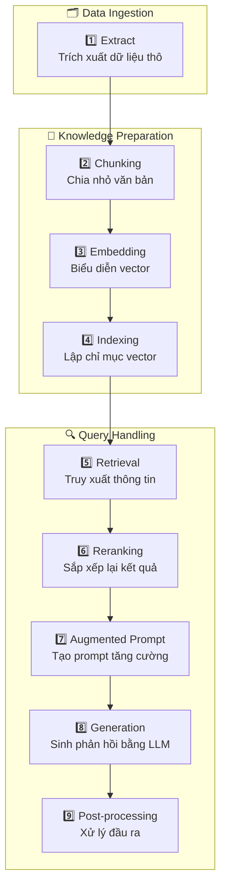

# 📘 Hướng Dẫn Toàn Diện về RAG: Từ Cơ Bản đến Nâng Cao - 👩🏼‍💻 RAG Zero to Hero Guide

Liên kết: [RAG Zero to Hero Guide](https://github.com/KalyanKS-NLP/rag-zero-to-hero-guide)

## 🧠 Giới Thiệu về RAG
Retrieval-Augmented Generation (RAG) là một kỹ thuật kết hợp giữa mô hình ngôn ngữ lớn (LLM) và cơ chế truy xuất thông tin từ nguồn kiến thức bên ngoài để tạo ra câu trả lời chính xác và cập nhật hơn. RAG giúp giảm thiểu hiện tượng "ảo giác" (hallucination) và cung cấp thông tin phù hợp với ngữ cảnh.

## 🧱 Khóa Học Cơ Bản về RAG
### 1. RAG là gì?
Giải thích khái niệm RAG thông qua ví dụ đơn giản, minh họa cách truy xuất và kết hợp thông tin để tạo ra câu trả lời.

### 2. Tại sao cần RAG?
Trình bày những hạn chế của LLMs như kiến thức bị giới hạn theo thời gian và khả năng tạo ra thông tin sai lệch, cùng cách RAG khắc phục những vấn đề này bằng cách truy xuất thông tin cập nhật từ bên ngoài.

### 3. Cách hoạt động của RAG
Mô tả chi tiết các bước trong quy trình RAG:

#### 🧾 Giải thích các bước trong pipeline
- Extract (Trích xuất dữ liệu thô): Thu thập và trích xuất nội dung từ các nguồn dữ liệu không có cấu trúc như PDF, HTML, DOCX, v.v.
- Chunking (Chia nhỏ văn bản): Chia văn bản thành các đoạn nhỏ (chunks) để phù hợp với giới hạn ngữ cảnh của mô hình ngôn ngữ lớn (LLM).
- Embedding (Biểu diễn vector): Chuyển đổi các đoạn văn bản thành các vector số bằng cách sử dụng mô hình embedding.
- Indexing (Lập chỉ mục vector): Lưu trữ các vector vào cơ sở dữ liệu vector để hỗ trợ truy xuất nhanh chóng.
- Retrieval (Truy xuất thông tin): Tìm kiếm và lấy ra các đoạn văn bản liên quan đến truy vấn của người dùng bằng cách so sánh vector.
- Reranking (Sắp xếp lại kết quả): Sử dụng mô hình reranker (thường là cross-encoder) để đánh giá lại mức độ liên quan của các đoạn văn bản truy xuất được và sắp xếp lại thứ tự ưu tiên.
- Augmented Prompt (Tạo prompt tăng cường): Kết hợp truy vấn của người dùng với các đoạn văn bản đã được sắp xếp lại để tạo thành prompt đầu vào cho mô hình ngôn ngữ lớn.
- Generation (Sinh phản hồi bằng LLM): Mô hình ngôn ngữ lớn tạo ra phản hồi dựa trên prompt tăng cường.
- Post-processing (Xử lý đầu ra): Làm sạch và định dạng lại phản hồi để phù hợp với yêu cầu của ứng dụng cụ thể.

### 4. Lợi ích và Thách thức của RAG
#### Lợi ích:

- Cải thiện độ chính xác của câu trả lời.

- Giảm thiểu hiện tượng "ảo giác".

- Cập nhật thông tin theo thời gian thực.

- Tiết kiệm chi phí so với việc huấn luyện lại mô hình.

#### Thách thức:

- Đảm bảo độ chính xác của thông tin truy xuất.

- Đồng bộ hóa ngữ cảnh giữa truy vấn và thông tin truy xuất.

- Xử lý độ trễ trong quá trình truy xuất và tạo câu trả lời.

---
### 5. Thuật ngữ cần biết trong RAG
Danh sách các thuật ngữ quan trọng liên quan đến RAG, giúp người học hiểu rõ hơn về các khái niệm và quy trình trong RAG.

#### 5.1 📘 Thuật ngữ: Extract (Trích xuất dữ liệu)
##### 🔤 Phát âm & Phiên âm
Từ vựng: Extract

Phiên âm IPA: /ɪkˈstrækt/

Cách phát âm tiếng Việt: [ích-strác-t]

##### 🧾 Định nghĩa đơn giản
Trong hệ thống RAG, extract đề cập đến quá trình trích xuất nội dung văn bản thô từ các nguồn dữ liệu không có cấu trúc như PDF, HTML, DOCX, v.v. Đây là bước tiền xử lý quan trọng, nhằm chuyển đổi dữ liệu không có cấu trúc thành văn bản thuần túy, sẵn sàng cho các bước xử lý tiếp theo như chunking và embedding.

##### 🧬 Từ nguyên học (Etymology)
Nguồn gốc: Từ tiếng Latin extrahere, có nghĩa là "kéo ra" hoặc "rút ra".

Cấu trúc: "ex-" (ra khỏi) + "trahere" (kéo) → "extract" (trích xuất).

##### 🔗 Từ đồng nghĩa / Gần nghĩa / Liên quan
Parse: phân tích cú pháp

Scrape: thu thập dữ liệu

Harvest: thu hoạch dữ liệu

Ingest: nạp dữ liệu

##### 🧩 Collocations thông dụng trong AI
Data extraction: trích xuất dữ liệu

Text extraction: trích xuất văn bản

Content extraction: trích xuất nội dung

Metadata extraction: trích xuất siêu dữ liệu

##### 💬 Ví dụ minh họa
Tiếng Anh:

"Before chunking, we need to extract clean text from the raw PDF files."

Tiếng Việt:

"Trước khi chia nhỏ, chúng ta cần trích xuất văn bản sạch từ các tệp PDF thô."

##### 🖼️ Hình ảnh liên tưởng trực quan
Biểu tượng: Một chiếc máy ép đang lấy nước từ trái cây, tượng trưng cho việc trích xuất nội dung từ dữ liệu thô.

Sơ đồ: Minh họa quá trình chuyển đổi từ tài liệu không có cấu trúc sang văn bản thuần túy.

##### 📖 Câu chuyện ngắn giúp ghi nhớ
Hãy tưởng tượng bạn đang làm nước cam. Bạn cần ép trái cam để lấy nước, loại bỏ vỏ và hạt. Tương tự, trong AI, "extract" là quá trình lấy thông tin hữu ích từ dữ liệu thô, loại bỏ những phần không cần thiết, chuẩn bị cho các bước xử lý tiếp theo.

##### 🎓 Ghi chú học thuật nâng cao
Trong hệ thống Retrieval-Augmented Generation (RAG), quá trình extract là bước đầu tiên trong pipeline, đóng vai trò quan trọng trong việc chuẩn bị dữ liệu. Dữ liệu từ các nguồn không có cấu trúc được trích xuất và làm sạch để chuyển thành văn bản thuần túy. Bước này đảm bảo rằng dữ liệu đầu vào cho các bước tiếp theo như chunking và embedding là chính xác và phù hợp, từ đó cải thiện hiệu quả của toàn bộ hệ thống RAG.

---
#### 5.2 📘 Thuật ngữ: Chunking (phân đoạn)
##### 🔤 Phát âm & Phiên âm
Từ vựng: Chunking

Phiên âm IPA: /ˈtʃʌŋ.kɪŋ/

Cách phát âm tiếng Việt: [chăng-king]

##### 🧾 Định nghĩa đơn giản
Chunking là quá trình chia nhỏ một khối văn bản lớn thành các phần nhỏ hơn, gọi là "chunks", để dễ dàng xử lý và truy xuất thông tin. Trong hệ thống RAG, chunking giúp mô hình ngôn ngữ lớn (LLM) tiếp cận thông tin một cách hiệu quả hơn bằng cách làm cho dữ liệu phù hợp với giới hạn ngữ cảnh của mô hình.

##### 🧬 Từ nguyên học (Etymology)
Nguồn gốc: Từ "chunk" trong tiếng Anh, có nghĩa là "một khối" hoặc "một phần lớn". Động từ "chunking" được hình thành bằng cách thêm hậu tố "-ing" để chỉ hành động chia nhỏ thành các phần.

##### 🔗 Từ đồng nghĩa / Gần nghĩa / Liên quan
Splitting: chia nhỏ

Segmenting: phân đoạn

Partitioning: phân chia

Dividing: chia tách

##### 🧩 Collocations thông dụng trong AI
Chunking strategy: chiến lược chia nhỏ

Fixed-size chunking: chia nhỏ theo kích thước cố định

Semantic chunking: chia nhỏ theo ngữ nghĩa

Recursive chunking: chia nhỏ đệ quy

Chunk overlap: phần chồng lặp giữa các đoạn

##### 💬 Ví dụ minh họa
Tiếng Anh:

"Effective chunking improves retrieval accuracy in RAG systems by ensuring that each chunk contains coherent and relevant information."

Tiếng Việt:

"Việc chia nhỏ hiệu quả cải thiện độ chính xác trong truy xuất thông tin của hệ thống RAG bằng cách đảm bảo mỗi đoạn chứa thông tin mạch lạc và liên quan."

##### 🖼️ Hình ảnh liên tưởng trực quan
Biểu tượng: Một khối văn bản lớn được cắt thành các mảnh nhỏ, giống như cắt một chiếc bánh thành các lát.

Sơ đồ: Minh họa quá trình chia văn bản thành các đoạn nhỏ, sau đó được nhúng và lưu trữ trong cơ sở dữ liệu vector.

##### 📖 Câu chuyện ngắn giúp ghi nhớ
Hãy tưởng tượng bạn đang đọc một cuốn sách dày cộp. Thay vì đọc hết một chương dài, bạn chia nó thành các đoạn nhỏ để dễ hiểu và nhớ lâu hơn. Tương tự, trong AI, chunking giúp chia nhỏ dữ liệu để mô hình xử lý hiệu quả hơn, giống như cách bạn chia nhỏ chương sách để học tốt hơn.

##### 🎓 Ghi chú học thuật nâng cao
Trong hệ thống Retrieval-Augmented Generation (RAG), chunking là bước tiền xử lý quan trọng. Dữ liệu được chia thành các đoạn nhỏ, sau đó được nhúng thành vector và lưu trữ trong cơ sở dữ liệu vector. Khi có truy vấn, hệ thống sẽ so sánh vector của truy vấn với các vector trong cơ sở dữ liệu để tìm ra thông tin liên quan nhất, hỗ trợ mô hình ngôn ngữ lớn tạo ra phản hồi chính xác và phù hợp.

---
#### 5.3 📘 Thuật ngữ: Embedding (nhúng, vector hóa dữ liệu)
##### 🔤 Phát âm & Phiên âm
Từ vựng: Embedding

Phiên âm IPA: /ɪmˈbɛd.ɪŋ/

Cách phát âm tiếng Việt: [im-bét-đing]

##### 🧾 Định nghĩa đơn giản
Trong lĩnh vực AI, đặc biệt là trong hệ thống Retrieval-Augmented Generation (RAG), embedding là quá trình chuyển đổi văn bản hoặc dữ liệu thành các vector số trong không gian nhiều chiều. Các vector này giữ lại thông tin ngữ nghĩa của dữ liệu gốc, cho phép hệ thống so sánh và tìm kiếm thông tin dựa trên ý nghĩa, thay vì chỉ dựa vào từ khóa.

##### 🧬 Từ nguyên học (Etymology)
Nguồn gốc: Từ "embed" trong tiếng Anh, có nghĩa là "nhúng vào" hoặc "gắn vào".

Cấu trúc: "em-" (vào) + "bed" (giường) → "embed" (gắn vào), thêm hậu tố "-ing" để chỉ hành động hoặc quá trình.

##### 🔗 Từ đồng nghĩa / Gần nghĩa / Liên quan
Vector representation: biểu diễn vector

Semantic encoding: mã hóa ngữ nghĩa

Feature vector: vector đặc trưng

Latent representation: biểu diễn tiềm ẩn

##### 🧩 Collocations thông dụng trong AI
Text embedding: nhúng văn bản

Sentence embedding: nhúng câu

Document embedding: nhúng tài liệu

Embedding model: mô hình nhúng

##### 💬 Ví dụ minh họa
Tiếng Anh:

"We use sentence embeddings to capture the semantic meaning of user queries for better information retrieval."

Tiếng Việt:

"Chúng tôi sử dụng nhúng câu để nắm bắt ý nghĩa ngữ nghĩa của các truy vấn người dùng nhằm cải thiện việc truy xuất thông tin."

##### 🖼️ Hình ảnh liên tưởng trực quan
Biểu tượng: Một bản đồ nhiệt (heatmap) thể hiện các điểm dữ liệu được ánh xạ trong không gian nhiều chiều.

Sơ đồ: Minh họa quá trình chuyển đổi từ văn bản sang vector và cách các vector tương tự nhau được nhóm lại gần nhau trong không gian.

##### 📖 Câu chuyện ngắn giúp ghi nhớ
Hãy tưởng tượng bạn có một bộ sưu tập sách với nhiều thể loại khác nhau. Để dễ dàng tìm kiếm, bạn quyết định gán cho mỗi cuốn sách một mã số dựa trên nội dung và thể loại của nó. Khi ai đó hỏi về một cuốn sách cụ thể, bạn chỉ cần so sánh mã số để tìm ra cuốn sách phù hợp. Tương tự, trong AI, embedding là cách hệ thống gán "mã số" cho dữ liệu để dễ dàng truy xuất và so sánh.

##### 🎓 Ghi chú học thuật nâng cao
Embedding là một kỹ thuật học biểu diễn (representation learning) trong học máy, nơi dữ liệu đầu vào (như văn bản, hình ảnh, âm thanh) được chuyển đổi thành các vector số trong không gian nhiều chiều. Các vector này được huấn luyện sao cho các điểm dữ liệu có ý nghĩa tương tự nhau sẽ có vector gần nhau trong không gian. Trong hệ thống RAG, embedding đóng vai trò quan trọng trong việc chuyển đổi cả truy vấn của người dùng và các đoạn văn bản trong cơ sở dữ liệu thành vector, từ đó cho phép so sánh và truy xuất thông tin dựa trên ngữ nghĩa.

---
#### 5.4 📘 Thuật ngữ: Indexing (tạo chỉ mục lưu trữ vector)
##### 🔤 Phát âm & Phiên âm
Từ vựng: Indexing

Phiên âm IPA: /ˈɪn.dɛk.sɪŋ/

Cách phát âm tiếng Việt: [in-đéc-xing]

##### 🧾 Định nghĩa đơn giản
Indexing là quá trình tổ chức và sắp xếp dữ liệu theo một cấu trúc nhất định để hỗ trợ việc tìm kiếm và truy xuất thông tin một cách nhanh chóng và hiệu quả. Trong lĩnh vực AI và đặc biệt là trong Retrieval-Augmented Generation (RAG), indexing liên quan đến việc chuyển đổi dữ liệu thành các biểu diễn số (vector) và lưu trữ chúng trong cơ sở dữ liệu vector để phục vụ cho việc truy xuất thông tin liên quan khi cần thiết.

##### 🧬 Từ nguyên học (Etymology)
Nguồn gốc: Từ "index" bắt nguồn từ tiếng Latin index, có nghĩa là "người chỉ dẫn" hoặc "danh sách". Đuôi "-ing" biến nó thành danh từ chỉ hành động hoặc quá trình.

##### 🔗 Từ đồng nghĩa / Gần nghĩa / Liên quan
Cataloging: lập danh mục

Organizing: tổ chức

Classifying: phân loại

Tagging: gắn thẻ

##### 🧩 Collocations thông dụng trong AI
Indexing process: quá trình lập chỉ mục

Inverted index: chỉ mục đảo

Vector indexing: lập chỉ mục vector

Semantic indexing: lập chỉ mục ngữ nghĩa

##### 💬 Ví dụ minh họa
Tiếng Anh:

"Effective indexing is crucial for fast and accurate information retrieval in large datasets."
lis.academy

Tiếng Việt:

"Việc lập chỉ mục hiệu quả là điều quan trọng để truy xuất thông tin nhanh chóng và chính xác trong các tập dữ liệu lớn."

##### 🖼️ Hình ảnh liên tưởng trực quan
Biểu tượng: Một cuốn sách với các mục lục được đánh dấu rõ ràng, tượng trưng cho việc tổ chức thông tin để dễ dàng truy cập.

Sơ đồ: Minh họa quá trình chuyển đổi dữ liệu thô thành các vector và lưu trữ trong cơ sở dữ liệu để phục vụ truy xuất.

##### 📖 Câu chuyện ngắn giúp ghi nhớ
Hãy tưởng tượng bạn đang tìm một công thức nấu ăn trong một cuốn sách dày hàng trăm trang. Nếu không có mục lục, bạn sẽ phải lật từng trang để tìm. Nhưng với một mục lục được lập chỉ mục tốt, bạn chỉ cần nhìn vào danh sách và đến đúng trang mình cần. Trong AI, indexing hoạt động tương tự, giúp mô hình nhanh chóng tìm thấy thông tin cần thiết trong kho dữ liệu khổng lồ.

##### 🎓 Ghi chú học thuật nâng cao
Trong Retrieval-Augmented Generation (RAG), indexing là bước đầu tiên và quan trọng trong quy trình. Dữ liệu được chuyển đổi thành các vector thông qua mô hình embedding và sau đó được lưu trữ trong cơ sở dữ liệu vector. Khi có truy vấn từ người dùng, hệ thống sẽ so sánh vector của truy vấn với các vector trong cơ sở dữ liệu để tìm ra thông tin liên quan nhất, từ đó hỗ trợ mô hình ngôn ngữ lớn (LLM) tạo ra phản hồi chính xác và phù hợp.

---
#### 5.5 📚 Thuật ngữ: Retrieval (truy xuất)
##### 🔤 Phát âm & Phiên âm
Từ vựng: Retrieval

Phiên âm IPA: /rɪˈtriː.vəl/

Cách phát âm tiếng Việt: [rì-tri-vồ]

##### 🧾 Định nghĩa đơn giản
Retrieval là quá trình tìm kiếm và lấy thông tin phù hợp từ một kho dữ liệu để sử dụng trong một nhiệm vụ cụ thể. Trong AI, đặc biệt là trong RAG, retrieval đề cập đến việc truy xuất các tài liệu hoặc dữ liệu liên quan từ một cơ sở dữ liệu để hỗ trợ quá trình tạo ra câu trả lời chính xác và có căn cứ theo trình tự sau:

- Nhận truy vấn từ người dùng.

- Sử dụng một hoặc nhiều phương pháp tìm kiếm (như `vector search`, `keyword search`, `hybrid search`) để truy xuất thông tin liên quan.

- Cung cấp các đoạn văn bản truy xuất được cho mô hình ngôn ngữ lớn để tạo ra phản hồi.

##### 🧬 Từ nguyên học (Etymology)
Nguồn gốc: Từ tiếng Anh "retrieve", bắt nguồn từ tiếng Pháp cổ "retrouver" có nghĩa là "tìm lại".

Cấu trúc: "Re-" (lại) + "trouver" (tìm kiếm) → "retrieval" (sự lấy lại, sự truy xuất).

##### 🔗 Từ đồng nghĩa / Gần nghĩa / Liên quan
Information Retrieval: Truy xuất thông tin

Search: Tìm kiếm

Querying: Truy vấn

Fetching: Lấy dữ liệu

##### 🧩 Collocations thông dụng trong AI
Retrieval system: Hệ thống truy xuất

Document retrieval: Truy xuất tài liệu

Information retrieval model: Mô hình truy xuất thông tin

Retrieval-based model: Mô hình dựa trên truy xuất

##### 💬 Ví dụ minh họa
Tiếng Anh:

"The retrieval component fetches relevant documents to provide context for the language model."

Tiếng Việt:

"Thành phần truy xuất lấy các tài liệu liên quan để cung cấp ngữ cảnh cho mô hình ngôn ngữ."

##### 🖼️ Hình ảnh liên tưởng trực quan
Biểu tượng: Một chiếc kính lúp đang tìm kiếm trong một đống tài liệu.

Sơ đồ: Mũi tên từ "Query" đến "Database" và sau đó đến "Relevant Documents".

##### 📖 Câu chuyện ngắn giúp ghi nhớ
Hãy tưởng tượng bạn đang ở trong một thư viện khổng lồ. Khi bạn cần thông tin về một chủ đề cụ thể, bạn không thể đọc hết tất cả các cuốn sách. Thay vào đó, bạn hỏi thủ thư (hệ thống retrieval), và họ nhanh chóng đưa cho bạn những cuốn sách liên quan nhất. Trong AI, retrieval hoạt động giống như người thủ thư đó, giúp mô hình ngôn ngữ tìm ra thông tin cần thiết một cách nhanh chóng và hiệu quả.

##### 🎓 Ghi chú học thuật nâng cao
Trong lĩnh vực Information Retrieval (IR), retrieval liên quan đến việc sử dụng các thuật toán và mô hình để tìm kiếm thông tin liên quan từ một tập hợp dữ liệu lớn. Các kỹ thuật phổ biến bao gồm:

TF-IDF (Term Frequency-Inverse Document Frequency): Đo lường tầm quan trọng của một từ trong một tài liệu so với toàn bộ tập hợp.

BM25: Một hàm xếp hạng dựa trên xác suất để đánh giá mức độ liên quan của tài liệu.

Vector Space Model: Đại diện tài liệu và truy vấn dưới dạng vector trong không gian nhiều chiều để tính toán độ tương đồng.

Trong bối cảnh RAG, retrieval thường sử dụng các mô hình học sâu để mã hóa truy vấn và tài liệu thành các vector, sau đó sử dụng các kỹ thuật như Approximate Nearest Neighbor (ANN) để tìm kiếm các tài liệu liên quan một cách hiệu quả.

---
#### 5.6 📘 Thuật ngữ: Rerank
##### 🔤 Phát âm & Phiên âm
Từ vựng: Rerank

Phiên âm IPA: /ˌriːˈræŋk/

Cách phát âm tiếng Việt: [ri-rengk]

##### 🧾 Định nghĩa đơn giản
Trong hệ thống Retrieval-Augmented Generation (RAG), rerank là quá trình sắp xếp lại danh sách các tài liệu hoặc đoạn văn bản đã được truy xuất ban đầu, nhằm ưu tiên những kết quả phù hợp nhất với truy vấn của người dùng. Điều này giúp mô hình ngôn ngữ lớn (LLM) nhận được thông tin chính xác và liên quan nhất để tạo ra phản hồi chất lượng cao.

##### 🧬 Từ nguyên học (Etymology)
Nguồn gốc: Kết hợp từ "re-" (lại) và "rank" (xếp hạng), nghĩa là "xếp hạng lại".

##### 🔗 Từ đồng nghĩa / Gần nghĩa / Liên quan
Reorder: sắp xếp lại

Rescore: chấm điểm lại

Prioritize: ưu tiên

Resort: tái sắp xếp

##### 🧩 Collocations thông dụng trong AI
Rerank model: mô hình sắp xếp lại

Rerank candidates: sắp xếp lại các ứng viên

Rerank results: sắp xếp lại kết quả

Rerank documents: sắp xếp lại tài liệu

##### 💬 Ví dụ minh họa
Tiếng Anh:

"After retrieving the top 20 documents, we use a rerank model to reorder them based on their relevance to the query."

Tiếng Việt:

"Sau khi truy xuất 20 tài liệu hàng đầu, chúng tôi sử dụng một mô hình sắp xếp lại để tái sắp xếp chúng dựa trên mức độ liên quan đến truy vấn."

##### 🖼️ Hình ảnh liên tưởng trực quan
Biểu tượng: Một danh sách các mục được đánh số lại, với các mục quan trọng hơn được đưa lên đầu.

Sơ đồ: Minh họa quá trình từ truy xuất ban đầu đến sắp xếp lại và cuối cùng là tạo phản hồi.

##### 📖 Câu chuyện ngắn giúp ghi nhớ
Hãy tưởng tượng bạn đang tìm kiếm một cuốn sách trong thư viện. Bạn nhận được một danh sách các cuốn sách liên quan, nhưng không phải tất cả đều phù hợp. Bạn quyết định sắp xếp lại danh sách này, đưa những cuốn sách phù hợp nhất lên đầu để dễ dàng lựa chọn. Tương tự, trong RAG, "rerank" giúp mô hình ngôn ngữ tập trung vào những thông tin quan trọng nhất.

##### 🎓 Ghi chú học thuật nâng cao
Trong hệ thống RAG, sau khi truy xuất một tập hợp các tài liệu dựa trên truy vấn của người dùng, bước rerank sử dụng các mô hình học sâu (như BERT-based cross-encoders) để đánh giá lại mức độ liên quan giữa truy vấn và từng tài liệu. Điều này giúp cải thiện độ chính xác của phản hồi bằng cách cung cấp cho mô hình ngôn ngữ những thông tin phù hợp nhất. Việc áp dụng rerank đặc biệt hữu ích trong các lĩnh vực yêu cầu độ chính xác cao như y tế, pháp luật và tài chính.

---
#### 5.7 📘 Thuật ngữ: Augmented prompt (tạo prompt tăng cường)
##### 🔤 Phát âm & Phiên âm
Từ vựng: Augmented

Phiên âm IPA: /ɔːɡˈmɛn.tɪd/

Cách phát âm tiếng Việt: [oóc-men-tịt]

##### 🧾 Định nghĩa đơn giản
Augmented có nghĩa là "được tăng cường" hoặc "được bổ sung thêm". Trong lĩnh vực AI, đặc biệt là trong Retrieval-Augmented Generation (RAG), "augmented" đề cập đến việc bổ sung thông tin từ các nguồn dữ liệu bên ngoài vào mô hình ngôn ngữ lớn (LLM) để cải thiện độ chính xác và tính liên quan của các phản hồi do mô hình tạo ra.

##### 🧬 Từ nguyên học (Etymology)
Nguồn gốc: Từ tiếng Latin augere, có nghĩa là "tăng lên" hoặc "làm lớn hơn".

Phát triển: Từ augment trong tiếng Anh xuất hiện vào cuối thế kỷ 14, mang nghĩa là "làm tăng lên", và augmented là dạng quá khứ phân từ của augment, mang nghĩa là "đã được tăng cường".

##### 🔗 Từ đồng nghĩa / Gần nghĩa / Liên quan
Enhanced: được cải thiện

Expanded: được mở rộng

Supplemented: được bổ sung

Boosted: được tăng cường

##### 🧩 Collocations thông dụng trong AI
Augmented data: dữ liệu được tăng cường

Augmented model: mô hình được tăng cường

Augmented generation: quá trình tạo sinh được tăng cường

Augmented reality: thực tế tăng cường

##### 💬 Ví dụ minh họa
Tiếng Anh:

"The model's performance improved significantly after being augmented with external knowledge sources."

Tiếng Việt:

"Hiệu suất của mô hình đã được cải thiện đáng kể sau khi được tăng cường với các nguồn kiến thức bên ngoài."

##### 🖼️ Hình ảnh liên tưởng trực quan
Biểu tượng: Một mô hình AI được kết nối với nhiều nguồn dữ liệu bên ngoài, thể hiện sự bổ sung thông tin.

Sơ đồ: Minh họa quá trình một mô hình ngôn ngữ lớn nhận thêm thông tin từ các cơ sở dữ liệu bên ngoài trước khi tạo ra phản hồi.

##### 📖 Câu chuyện ngắn giúp ghi nhớ
Hãy tưởng tượng một đầu bếp đang chuẩn bị món ăn. Ban đầu, anh ta chỉ sử dụng những nguyên liệu có sẵn trong bếp (tương tự như dữ liệu huấn luyện ban đầu của mô hình AI). Tuy nhiên, để món ăn trở nên đặc biệt và phù hợp với khẩu vị của khách hàng, anh ta quyết định ra chợ để tìm thêm các nguyên liệu tươi ngon và đặc biệt (giống như việc mô hình AI truy xuất thêm thông tin từ các nguồn bên ngoài). Kết quả là món ăn trở nên phong phú và hấp dẫn hơn. Tương tự, trong AI, "augmented" giúp mô hình tạo ra phản hồi chính xác và phù hợp hơn bằng cách bổ sung thông tin từ bên ngoài.

##### 🎓 Ghi chú học thuật nâng cao
Trong bối cảnh Retrieval-Augmented Generation (RAG), "augmented" đề cập đến việc kết hợp thông tin truy xuất từ các nguồn dữ liệu bên ngoài vào quá trình tạo sinh của mô hình ngôn ngữ lớn (LLM). Điều này giúp mô hình:

Cung cấp phản hồi dựa trên thông tin cập nhật và chính xác hơn.

Giảm thiểu hiện tượng "ảo giác" (hallucination) trong các phản hồi.

Tăng cường khả năng xử lý các truy vấn yêu cầu kiến thức chuyên sâu hoặc cập nhật.

Phương pháp này cho phép mô hình AI linh hoạt hơn trong việc xử lý các tác vụ phức tạp mà không cần phải huấn luyện lại toàn bộ mô hình với dữ liệu mới.

---
#### 5.8 📘 Thuật ngữ: Generation
##### 🔤 Phát âm & Phiên âm
Từ vựng: Generation

Phiên âm IPA: /ˌdʒɛn.əˈreɪ.ʃən/

Cách phát âm tiếng Việt: [gen-nờ-rây-shần]

##### 🧾 Định nghĩa đơn giản
Generation trong lĩnh vực AI đề cập đến quá trình mô hình ngôn ngữ lớn (LLM) tạo ra nội dung mới, chẳng hạn như văn bản, hình ảnh hoặc mã nguồn, dựa trên dữ liệu đầu vào và kiến thức đã học. Trong Retrieval-Augmented Generation (RAG), "generation" là bước mà mô hình sử dụng thông tin truy xuất được để tạo ra phản hồi phù hợp và chính xác hơn.

##### 🧬 Từ nguyên học (Etymology)
Nguồn gốc: Từ tiếng Latin generatio, có nghĩa là "sự sinh ra" hoặc "sự tạo ra", bắt nguồn từ động từ generare nghĩa là "sinh ra" hoặc "tạo ra".

##### 🔗 Từ đồng nghĩa / Gần nghĩa / Liên quan
Creation: sự tạo ra

Production: sự sản xuất

Synthesis: sự tổng hợp

Formation: sự hình thành

##### 🧩 Collocations thông dụng trong AI
Text generation: tạo văn bản

Image generation: tạo hình ảnh

Content generation: tạo nội dung

Language generation: tạo ngôn ngữ

##### 💬 Ví dụ minh họa
Tiếng Anh:

"The generation component of the RAG model produces answers based on retrieved documents."

Tiếng Việt:

"Thành phần tạo sinh của mô hình RAG tạo ra câu trả lời dựa trên các tài liệu đã được truy xuất."

##### 🖼️ Hình ảnh liên tưởng trực quan
Biểu tượng: Một chiếc máy in đang in ra văn bản từ một đám mây dữ liệu, tượng trưng cho việc tạo ra nội dung mới từ thông tin đã học.

Sơ đồ: Minh họa quá trình mô hình nhận đầu vào, xử lý và tạo ra đầu ra mới.

##### 📖 Câu chuyện ngắn giúp ghi nhớ
Hãy tưởng tượng một nhà văn đang viết một cuốn tiểu thuyết. Anh ta thu thập thông tin, nghiên cứu và sau đó sử dụng trí tưởng tượng của mình để tạo ra một câu chuyện hoàn toàn mới. Tương tự, trong AI, "generation" là quá trình mô hình sử dụng kiến thức đã học để tạo ra nội dung mới, giống như nhà văn tạo ra câu chuyện của mình.

##### 🎓 Ghi chú học thuật nâng cao
Trong Retrieval-Augmented Generation (RAG), "generation" là giai đoạn mà mô hình ngôn ngữ lớn (LLM) sử dụng thông tin truy xuất được để tạo ra phản hồi. Mô hình kết hợp giữa khả năng hiểu ngôn ngữ tự nhiên và thông tin bổ sung từ các nguồn dữ liệu bên ngoài để cung cấp câu trả lời chính xác và phù hợp hơn.

---
#### 5.9 📘 Thuật ngữ: Post-processing
##### 🔤 Phát âm & Phiên âm
Từ vựng: Post-processing

Phiên âm IPA: /ˌpoʊstˈprɑːsɛsɪŋ/

Cách phát âm tiếng Việt: [pốt-prô-ses-sing]

##### 🧾 Định nghĩa đơn giản
Trong hệ thống Retrieval-Augmented Generation (RAG), post-processing là giai đoạn xử lý đầu ra sau khi mô hình ngôn ngữ lớn (LLM) đã tạo ra phản hồi. Mục tiêu của bước này là cải thiện chất lượng, độ chính xác và tính phù hợp của phản hồi trước khi trình bày cho người dùng.

##### 🧬 Từ nguyên học (Etymology)
Nguồn gốc: Kết hợp từ "post-" (sau) và "processing" (xử lý), nghĩa là "xử lý sau".

##### 🔗 Từ đồng nghĩa / Gần nghĩa / Liên quan
Output refinement: tinh chỉnh đầu ra

Response validation: xác thực phản hồi

Answer polishing: làm mượt câu trả lời

##### 🧩 Collocations thông dụng trong AI
Post-processing step: bước xử lý sau

Post-processing pipeline: quy trình xử lý sau

Post-processing module: mô-đun xử lý sau

##### 💬 Ví dụ minh họa
Tiếng Anh:

"After generating the initial response, we apply post-processing to correct any factual errors and improve clarity."

Tiếng Việt:

"Sau khi tạo phản hồi ban đầu, chúng tôi áp dụng xử lý sau để sửa lỗi thực tế và cải thiện độ rõ ràng."

##### 🖼️ Hình ảnh liên tưởng trực quan
Biểu tượng: Một cây bút chì đang chỉnh sửa văn bản, tượng trưng cho việc tinh chỉnh phản hồi sau khi tạo.

Sơ đồ: Minh họa quy trình từ truy vấn đến phản hồi, với bước post-processing là giai đoạn cuối cùng trước khi trình bày cho người dùng.

##### 📖 Câu chuyện ngắn giúp ghi nhớ
Hãy tưởng tượng bạn là một đầu bếp. Sau khi nấu xong món ăn, bạn nếm thử và nhận thấy cần thêm một chút gia vị để hoàn thiện hương vị. Việc thêm gia vị này giống như bước post-processing trong RAG—tinh chỉnh phản hồi để đạt được chất lượng tốt nhất trước khi "phục vụ" cho người dùng.

##### 🎓 Ghi chú học thuật nâng cao
Trong hệ thống RAG, post-processing có thể bao gồm các kỹ thuật như:

- Kiểm tra sự thật (Fact-checking): Đảm bảo rằng phản hồi không chứa thông tin sai lệch hoặc không có căn cứ.

- Chỉnh sửa ngôn ngữ (Language refinement): Cải thiện ngữ pháp, chính tả và phong cách diễn đạt để phản hồi dễ hiểu và chuyên nghiệp hơn.

- Xác thực nguồn (Source attribution): Đảm bảo rằng các trích dẫn và tham chiếu trong phản hồi được liên kết đúng với nguồn gốc của chúng.

- Tùy chỉnh theo ngữ cảnh (Contextual adaptation): Điều chỉnh phản hồi để phù hợp với ngữ cảnh cụ thể hoặc yêu cầu của người dùng.

Việc thực hiện post-processing hiệu quả giúp nâng cao độ tin cậy và chất lượng của hệ thống RAG, đặc biệt trong các lĩnh vực yêu cầu độ chính xác cao như y tế, pháp luật và tài chính.

---
### 6. Lộ trình học RAG
Hướng dẫn chi tiết từ cơ bản đến nâng cao, bao gồm:

- Hiểu biết về Generative AI và LLMs.
- Sử dụng các framework như LangChain, LlamaIndex.
- Chiến lược chia nhỏ dữ liệu (chunking).
- Trích xuất dữ liệu từ tài liệu và web.
- Sử dụng cơ sở dữ liệu vector như FAISS, ChromaDB.
- Triển khai RAG từ đầu hoặc sử dụng các công cụ hỗ trợ.
- Đánh giá và giám sát hiệu suất của hệ thống RAG.

---
## 🧪 Hệ thống Đánh Giá RAG
### 1. Giới thiệu về các chỉ số đánh giá RAG
Tổng quan về các chỉ số đánh giá hiệu suất của hệ thống RAG, bao gồm:

##### Đánh giá bộ truy xuất (Retriever):

Độ chính xác ngữ cảnh (Context Precision).

Độ bao phủ ngữ cảnh (Context Recall).

Độ phù hợp của ngữ cảnh (Context Relevancy).

##### Đánh giá bộ tạo câu trả lời (Generator):

- Độ trung thực (Faithfulness).

- Tỷ lệ "ảo giác" (Hallucination).

- Độ liên quan của câu trả lời (Response Relevancy).

### 2. Đánh giá RAG bằng RAGAS
Hướng dẫn sử dụng thư viện RAGAS để đánh giá hiệu suất của hệ thống RAG thông qua các chỉ số đã đề cập.

### 🧰 Bộ Công Cụ RAG
##### 🔴 Frameworks
LangChain: Framework phát triển ứng dụng sử dụng LLMs.

LlamaIndex: Framework quản lý dữ liệu cho ứng dụng LLMs.

Haystack: Framework xây dựng ứng dụng LLMs từ đầu đến cuối.

fastRAG: Framework nghiên cứu tối ưu hóa pipeline RAG.

Llmware: Framework xây dựng pipeline RAG cho doanh nghiệp.

##### 🟠 Nghiên cứu
FlashRAG: Bộ công cụ Python cho nghiên cứu RAG hiệu quả, bao gồm 36 bộ dữ liệu benchmark và 16 thuật toán RAG tiên tiến.

##### 🟡 Trích xuất dữ liệu - Web Scraping
Crawl4AI: Công cụ crawler và scraper thân thiện với LLMs.

ScrapeGraphAI: Thư viện Python sử dụng LLM và logic đồ thị để tạo pipeline scraping cho web và tài liệu.

Crawlee: Thư viện scraping và tự động hóa trình duyệt.

##### 🟢 Trích xuất dữ liệu - Tài liệu
Docling: Công cụ phân tích và xuất tài liệu sang định dạng mong muốn.

Llama Parse: Trình phân tích tài liệu gốc GenAI cho các ứng dụng LLM.

PyMuPDF4LLM: Thư viện trích xuất nội dung PDF cho môi trường LLM & RAG.

MegaParse: Trình phân tích cho mọi loại tài liệu.

ExtractThinker: Thư viện trí tuệ tài liệu cho LLMs.

##### 🔵 Cơ sở dữ liệu vector
SQLite-Vec: Tiện ích mở rộng tìm kiếm vector cho SQLite.

FAISS: Thư viện tìm kiếm tương đồng và phân cụm vector hiệu quả.

PGVector: Tìm kiếm tương đồng vector mã nguồn mở cho Postgres.

Chroma: Cơ sở dữ liệu embedding mã nguồn mở, tối ưu cho ứng dụng LLMs.

Qdrant: Cơ sở dữ liệu vector hiệu suất cao cho thế hệ AI tiếp theo.

Pinecone: Cơ sở dữ liệu vector cho ứng dụng học máy.

Weaviate: Cơ sở dữ liệu vector mã nguồn mở, mạnh mẽ và mở rộng.

##### 📄 Các Bài Báo Khảo Sát về RAG
Tổng hợp các bài báo khảo sát toàn diện về RAG, bao gồm:

[Extracting Knowledge from PDFs: A Step-by-Step RAG Implementation with LangChain](https://blog.gopenai.com/extracting-knowledge-from-pdfs-a-step-by-step-rag-implementation-with-langchain-2f163628da8b)

[Retrieval Augmented Generation (RAG) for LLMs](https://www.promptingguide.ai/research/rag)

[Retrieval-Augmented Generation for Large Language Models: A Survey](https://arxiv.org/abs/2312.10997)

[A Comprehensive Survey of Retrieval-Augmented Generation (RAG): Evolution, Current Landscape and Future Directions](https://arxiv.org/abs/2410.12837)

[Attention Is All You Need](https://arxiv.org/abs/1706.03762)

[From Zero to Hero: Building Your First LangChain Agent with RAG](https://dev.to/vaib/from-zero-to-hero-building-your-first-langchain-agent-with-rag-1c8h)

[Mastering RAG Architecture (from Zero to Hero)](https://medium.com/@wriath18/master-rag-architecture-from-zero-to-hero-d3919440f790)

[Best RAG tools: Embedding Models, Libraries and Frameworks](https://research.aimultiple.com/retrieval-augmented-generation/)

[Top 10 RAG Use Cases and 17 Essential Tools for Implementation](https://www.chatbees.ai/blog/rag-use-cases)

[Top 9 RAG Tools to Boost Your LLM Workflows](https://lakefs.io/blog/rag-tools/)

---
## 🔗 Giao thức và tiêu chuẩn giao tiếp giữa các bước trong pipeline
Để đảm bảo tính linh hoạt và khả năng mở rộng, các bước trong pipeline RAG nên giao tiếp với nhau thông qua các giao thức và tiêu chuẩn sau:

### 🔹 Giao thức giao tiếp
HTTP/HTTPS với RESTful API: Phù hợp cho các hệ thống phân tán và dễ dàng tích hợp với các dịch vụ khác.

gRPC: Cung cấp hiệu suất cao và hỗ trợ truyền dữ liệu nhị phân, thích hợp cho các hệ thống yêu cầu tốc độ và hiệu quả.

Message Queues (e.g., Kafka, RabbitMQ): Hữu ích cho việc xử lý dữ liệu bất đồng bộ và đảm bảo độ tin cậy trong truyền thông tin.

### 🔹 Tiêu chuẩn định dạng dữ liệu
JSON: Định dạng phổ biến, dễ đọc và dễ xử lý, phù hợp cho hầu hết các API.

Protocol Buffers (Protobuf): Định dạng nhị phân hiệu quả, phù hợp cho các hệ thống yêu cầu hiệu suất cao.

### 🔹 Tiêu chuẩn giao tiếp
OpenAPI Specification (Swagger): Giúp định nghĩa rõ ràng các API và tự động hóa việc tạo tài liệu và mã nguồn.

AsyncAPI: Phù hợp cho việc mô tả các API bất đồng bộ, đặc biệt hữu ích khi sử dụng message queues.

## 🔄 Cách thay thế từng công cụ/thư viện/core lõi mà không cần thay đổi pipeline
Để đảm bảo khả năng thay thế linh hoạt các thành phần trong pipeline mà không ảnh hưởng đến toàn bộ hệ thống, bạn nên áp dụng các chiến lược sau:

### 🔹 Thiết kế theo kiến trúc mô-đun
Định nghĩa rõ ràng các giao diện (interfaces): Mỗi thành phần trong pipeline nên có một giao diện rõ ràng, định nghĩa các phương thức và định dạng dữ liệu đầu vào/đầu ra.

Tách biệt logic xử lý và giao tiếp: Giúp dễ dàng thay thế logic xử lý mà không ảnh hưởng đến cách các thành phần giao tiếp với nhau.

### 🔹 Sử dụng các công cụ và framework hỗ trợ
LangChain: Hỗ trợ xây dựng các pipeline RAG với khả năng thay thế linh hoạt các thành phần như retriever, LLM, và vector store.

Haystack: Cung cấp kiến trúc modular, cho phép dễ dàng thay thế và kết hợp các thành phần khác nhau trong pipeline.

### 🔹 Áp dụng các mẫu thiết kế phần mềm
Factory Pattern: Cho phép tạo ra các đối tượng mà không cần chỉ định lớp cụ thể, giúp dễ dàng thay thế các thành phần.

Adapter Pattern: Cho phép các thành phần không tương thích làm việc cùng nhau bằng cách chuyển đổi giao diện của một lớp thành giao diện khác.

### 🔹 Sử dụng cấu hình thay vì mã hóa cứng
Tệp cấu hình (e.g., YAML, JSON): Lưu trữ thông tin về các thành phần được sử dụng, cho phép thay đổi mà không cần sửa mã nguồn.

Biến môi trường: Cho phép cấu hình linh hoạt trong các môi trường triển khai khác nhau.

---
## 🧭 Phân loại giao diện người dùng và giám sát theo từng bước trong pipeline RAG
| Bước                 | Mô tả                  | Giao diện người dùng (End-user UI) | Giao diện quản trị (Admin UI) | Giao diện Dev                                                                            |   |
| -------------------- | ---------------------- | ---------------------------------- | ----------------------------- | ---------------------------------------------------------------------------------- | - |
| 1️⃣ Extract          | Trích xuất dữ liệu thô | ❌                                  | ❌                             | ✅                   |   |
| 2️⃣ Chunking         | Chia nhỏ văn bản       | ❌                                  | ✅                             | ✅                   |   |
| 3️⃣ Embedding        | Biểu diễn vector       | ❌                                  | ❌                             | ✅                   |   |
| 4️⃣ Indexing         | Lập chỉ mục vector     | ❌                                  | ❌                             | ✅                   |   |
| 5️⃣ Retrieval        | Truy xuất thông tin    | ❌                                  | ❌                             | ✅                   |   |
| 6️⃣ Reranking        | Sắp xếp lại kết quả    | ✅                                  | ✅                             | ✅                   |   |
| 7️⃣ Augmented Prompt | Tạo prompt tăng cường  | ❌                                  | ✅                             | ✅                   |   |
| 8️⃣ Generation       | Sinh phản hồi bằng LLM | ❌                                  | ❌                             | ✅                   |   |
| 9️⃣ Post-processing  | Xử lý đầu ra           | ✅                                  | ✅                             | ✅                   |   |

## 🧩 Giao diện hội thoại (UI chat) cho người dùng cuối
- Ô nhập câu hỏi.
- Hiển thị phản hồi từ chatbot (bao gồm xem cả trích dẫn nguồn gốc - số trang - số mục heading).
- Tùy chọn xem thứ tự sắp xếp lại của các đoạn văn bản (nếu chọn chế độ reasoning).
- Tùy chọn đánh giá phản hồi (hữu ích/không hữu ích).
- Tùy chọn báo cáo lỗi hoặc phản hồi không chính xác.

## 🛠️ Giao diện quản trị Admin UI:
- Hiển thị phân đoạn văn bản được chia nhỏ.
- Hiển thị các đoạn văn bản được truy xuất.
- Hiển thị thứ tự sắp xếp lại của các đoạn văn bản.
- Hiển thị prompt tăng cường.
- Hiển thị các cảnh báo và lỗi hệ thống trong bảng điều khiển tổng quan.

### Cấu hình hệ thống:
- Theo dõi truy vấn và phản hồi cụ thể để phân tích lỗi.
- Tùy chọn cấu hình cho từng bước (ví dụ: kích thước chunk, mô hình embedding).
- Quản lý phiên bản và cập nhật mô hình.
- Nhật ký và theo dõi

## 🛠️ Công cụ giám sát của Devs:

### Giám sát hiệu suất:
- Thời gian xử lý trung bình cho từng bước.
- Tỷ lệ lỗi và thất bại.
- Sử dụng tài nguyên hệ thống (CPU, bộ nhớ).

### 🔧 Công cụ giám sát và quan sát đề xuất
- Prometheus & Grafana: Giám sát hiệu suất và trực quan hóa dữ liệu.

- ELK Stack (Elasticsearch, Logstash, Kibana): Thu thập và phân tích nhật ký hệ thống.

- Jaeger: Theo dõi truy vết phân tán trong hệ thống microservices.

- Langfuse: Giám sát và phân tích các ứng dụng sử dụng mô hình ngôn ngữ lớn (LLM).

- Ragas: Đánh giá và giám sát chất lượng phản hồi trong hệ thống RAG.

---
