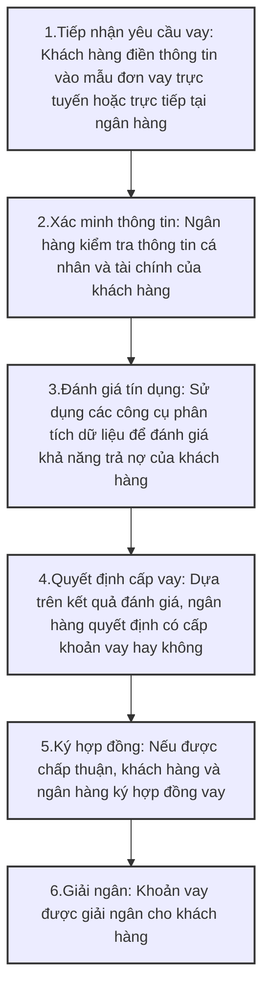

# Phần 1 - LOS Nghiệp vụ khởi tạo khoản vay

## Quy trình nghiệp vụ
Khởi tạo khoản vay trong bối cảnh chuyển đổi số (digital transformation) là một quá trình quan trọng trong ngành tài chính, đặc biệt là trong lĩnh vực ngân hàng và cho vay. Dưới đây là một cái nhìn tổng quan về khái niệm này, các bước thực hiện, và lợi ích của việc áp dụng công nghệ số trong quy trình khởi tạo khoản vay.

### 1. Khái niệm Khởi tạo Khoản Vay
Khởi tạo khoản vay là quá trình mà khách hàng (cá nhân hoặc doanh nghiệp) yêu cầu một khoản vay từ ngân hàng hoặc tổ chức tài chính. Quá trình này bao gồm việc thu thập thông tin, đánh giá khả năng trả nợ, và quyết định cấp phát khoản vay.

### 2. Các Bước Khởi Tạo Khoản Vay
Quá trình khởi tạo khoản vay thường bao gồm các bước sau:


### 3. Chuyển Đổi Số trong Khởi Tạo Khoản Vay
Chuyển đổi số mang lại nhiều cải tiến cho quy trình khởi tạo khoản vay, bao gồm:
- Tự động hóa quy trình: Sử dụng phần mềm để tự động hóa các bước như tiếp nhận yêu cầu, xác minh thông tin, và đánh giá tín dụng.
- Phân tích dữ liệu lớn: Sử dụng phân tích dữ liệu để đánh giá rủi ro và khả năng trả nợ một cách chính xác hơn.
- Trải nghiệm khách hàng tốt hơn: Cung cấp giao diện người dùng thân thiện và dễ sử dụng cho khách hàng, giúp họ dễ dàng thực hiện các bước vay.
- Tiết kiệm thời gian: Giảm thiểu thời gian xử lý từ khi khách hàng yêu cầu vay đến khi khoản vay được giải ngân.
- Quản lý rủi ro hiệu quả: Sử dụng công nghệ để theo dõi và quản lý rủi ro liên quan đến khoản vay.

### 4. Lợi Ích của Chuyển Đổi Số trong Khởi Tạo Khoản Vay
- Tăng cường hiệu quả: Giảm thiểu thời gian và chi phí cho quy trình khởi tạo khoản vay.
- Cải thiện độ chính xác: Giảm thiểu sai sót do con người và tăng cường độ chính xác trong đánh giá tín dụng.
- Tăng cường khả năng cạnh tranh: Các ngân hàng và tổ chức tài chính có thể cung cấp dịch vụ nhanh chóng và hiệu quả hơn, thu hút nhiều khách hàng hơn.

---
## Phân biệt RLOS (Retail Loan Origination System) và CLOS (Commercial Loan Origination System) 
Đây là hai hệ thống quản lý quy trình khởi tạo khoản vay, nhưng chúng phục vụ cho các mục đích khác nhau và có những đặc điểm riêng biệt.

| **Tiêu chí**                  | **RLOS (Retail Loan Origination System)**                             | **CLOS (Commercial Loan Origination System)**                             |
|-------------------------------|----------------------------------------------------------------------|---------------------------------------------------------------------------|
| **Định nghĩa**                 | Hệ thống quản lý quy trình khởi tạo khoản vay cho khách hàng cá nhân như vay mua nhà, vay tiêu dùng, vay tín chấp. | Hệ thống quản lý quy trình khởi tạo khoản vay cho khách hàng doanh nghiệp như vay kinh doanh, vay đầu tư, tín dụng thương mại. |
| **Đối tượng Khách hàng**       | Hướng đến khách hàng cá nhân, bao gồm người tiêu dùng và hộ gia đình. | Hướng đến khách hàng doanh nghiệp, bao gồm công ty nhỏ, vừa và lớn. |
| **Quy trình Khởi tạo Khoản Vay** | Quy trình đơn giản và nhanh chóng với các bước điền đơn, xác minh thông tin cá nhân, và đánh giá tín dụng. | Quy trình phức tạp hơn với thu thập nhiều thông tin tài chính, phân tích rủi ro và đánh giá khả năng trả nợ của doanh nghiệp. |
| **Tính Năng và Công Cụ**      | Giao diện người dùng thân thiện, tự động hóa quy trình, tích hợp với các hệ thống thanh toán và quản lý khách hàng. | Các tính năng phức tạp như phân tích tài chính, quản lý tài sản thế chấp, theo dõi các khoản vay trong thời gian dài. |
| **Mục tiêu và Kết quả**       | Cung cấp trải nghiệm khách hàng tốt và xử lý nhanh chóng các khoản vay cá nhân. | Tối ưu hóa quy trình phê duyệt khoản vay cho doanh nghiệp, giảm thiểu rủi ro và đảm bảo hiệu quả trong việc cấp phát khoản vay. |

---

## Các ngành nghề kinh doanh được hỗ trợ

**1.Các khoản cho vay bán lẻ**
- Xử lý các khoản cho vay bán lẻ trên thị trường đại chúng thường có nghĩa là phải ứng phó với số lượng lớn các yêu cầu điển hình đối vớicác khoản vay tương đối nhỏ. Để xử lý hiệu quả luồng ứng dụng quan trọng và duy trì tính cạnh tranh, người cho vay cần tạo ra một nền tảng công nghệ đáng tin cậy có thể hỗ trợtự động hóa thủ tục khởi tạo khoản vay, quản lý rủi ro qua các danh mục tín dụng, nhanh chóng đưa ra quyết định cho vay, tạo sản phẩm mới và tùy chỉnh bảo hiểm khởi tạo thông minh.

**2.Các khoản cho vay kinh doanh**
- Trường hợp bộ phận cho vay của doanh nghiệp cung cấp các sản phẩm tín dụng tiêu chuẩn – khách hàng doanh nghiệp vay số lượng lớn hơn và yêu cầu phương pháp riêng hiếm khi xảy ra, và ngân hàng cần tùy chỉnh và đề xuất ra các giải pháp tốt nhất cho từng nhiệm vụ kinh doanh cụ thể. Mức độ rủi ro cao hơn do số tiền vay lớn hơn là một đặc thù quan trọng khác của hoạt động cho vay doanh nghiệp. Dựa vào giải pháp FOXAI LOS hiện đại để xử lý rủi ro đúng cách và cung cấp cho khách hàng của bạn các dịch vụ chất lượng cao cá nhân hóa.

**3.Các khoản cho vay SME**
- Các khoản cho vay Doanh nghiệp vừa và nhỏ tương đối nhỏ, nhưng chúng gây ra chi phí hành chính cao hơn và yêu cầu nguồn nhân lực nhiều hơn so với các hình thức cho vay khác. Nhiều chủ sở hữu của các doanh nghiệp vừa và nhỏ rất khó tiếp cận vì họ sinh sống ở các vùng nông thôn hẻo lánh. Ngoài ra, người cho vay phải xử lý nhiều thông tin tài chính để đưa ra quyết định đúng đắn và giảm thiểu rủi ro. Hợp lý hóa các thủ tục này, tiếp cận khách hàng từ xa và tạo thuận lợi cho toàn bộ quy trình cho vay Doanh nghiệp vừa và nhỏ với các công cụ và tính năng công nghệ hiện đại do FOXAI LOS cung cấp.

**4.Các khoản cho vay tài chính vi mô** 
- Dịch vụ tài chính vi mô cho các hộ nghèo và thu nhập thấp và các doanh nghiệp của họ, thường được gọi là doanh nghiệp siêu nhỏ, đóng một vai trò quan trọng trong việc giảm nghèo. Nắm bắt nhóm khách hàng rộng lớn này, tiếp cận khách hàng từ xa của bạn và thiết lập việc khởi tạo khoản vay một cách thông minh và các quy trình quản lý với nhiều công cụ tiên tiến nhất được cung cấp bởi giải pháp FOXAI LOS.

---
# Phần 2 - Ứng dụng công nghệ RPA (Robotic Process Automation) trong quy trình khởi tạo khoản vay của FoxAI LOS
## 1.FoxAI LOS hỗ trợ cán bộ ngân hàng "Tư vấn bên vay" trong bước "1.Tiếp nhận yêu cầu vay" như sau:

- **Xác định nhu cầu của khách hàng:** Hiểu rõ yêu cầu vay của khách hàng để đưa ra giải pháp phù hợp.
```
- Về công cụ: RPA có thể tích hợp với các form trực tuyến hoặc chatbot (Chatbase, Dialogflow, ChatGPT) để thu thập thông tin chi tiết từ khách hàng về yêu cầu vay.

- Về Dữ liệu thu thập: Các thông tin cần thiết bao gồm mục đích vay, số tiền vay yêu cầu, thời gian vay, thu nhập, và các yếu tố tài chính khác.
Sau khi thu thập thông tin, hệ thống RPA có thể sử dụng quy tắc logic (Rule-based Logic) để phân loại và xử lý yêu cầu vay của khách hàng.
Ví dụ: Nếu khách hàng yêu cầu vay để mua nhà, hệ thống sẽ tự động nhận diện và đưa ra các sản phẩm vay thế chấp nhà ở. Nếu mục đích vay là vay tiêu dùng, hệ thống sẽ gợi ý các khoản vay tiêu dùng không cần tài sản thế chấp.

- Về Thuật toán phân tích: Các thuật toán phân loại (Classification Algorithms) như Decision Trees hoặc Random Forest có thể được áp dụng để phân loại mục đích vay và các yếu tố khác. Dựa vào các thuộc tính này, hệ thống sẽ xác định sản phẩm vay phù hợp.
Ví dụ: Dựa trên mức thu nhập của khách hàng, hệ thống có thể chọn ra các sản phẩm vay tiêu dùng hoặc vay mua ô tô với điều kiện tín dụng khác nhau.

- Hệ thống RPA có thể kết hợp với các công cụ phân tích dữ liệu lớn (Big Data tools) và các mô hình học máy (Machine Learning) để phân tích các hành vi và lịch sử tín dụng của khách hàng.
Ví dụ: Sử dụng các công cụ phân tích dữ liệu như Apache Spark, Hadoop, hoặc Python Pandas để xử lý và phân tích các dữ liệu lịch sử từ các khách hàng trước đó. Việc phân tích này có thể giúp dự đoán và hiểu rõ nhu cầu vay của khách hàng.
```

- **Lựa chọn các sản phẩm ngân hàng phù hợp:** Chọn sản phẩm vay thích hợp dựa trên nhu cầu và điều kiện của khách hàng.
```
- Hệ thống RPA có thể xác định các sản phẩm vay phù hợp từ danh sách sản phẩm của ngân hàng thông qua một quy trình kết hợp giữa RPA và các công cụ phân tích dữ liệu như thuật toán học máy (Machine Learning) và quy tắc (rule-based logic).

- Thứ nhất, các quy tắc cố định (rule-based) được lập trình sẵn để xác định các sản phẩm vay phù hợp. Các quy tắc này dựa trên những yếu tố cụ thể mà ngân hàng đã định sẵn.
Ví dụ:
+ Nếu mục đích vay là mua nhà, thì sản phẩm vay phù hợp có thể là vay thế chấp nhà ở.
+ Nếu mức thu nhập của khách hàng vượt quá một ngưỡng cụ thể (ví dụ: 20 triệu đồng/tháng), hệ thống có thể gợi ý các khoản vay vốn lưu động hoặc vay tiêu dùng với số tiền lớn hơn.

- Thứ hai, các thuật toán khuyến nghị bao gồm:
+ Collaborative Filtering: Dựa trên các đặc điểm tương tự của các khách hàng khác, hệ thống có thể gợi ý các sản phẩm vay phù hợp.
+ Content-Based Filtering: Dựa trên các đặc điểm của khách hàng (thu nhập, mục đích vay, khả năng trả nợ), hệ thống có thể gợi ý các khoản vay có kỳ hạn và lãi suất phù hợp dựa trên cấu trúc if-else.
+ Thuật toán phân loại (Classification Algorithm): Các thuật toán như Decision Trees hoặc Random Forest có thể được sử dụng để phân loại khách hàng vào các nhóm khác nhau (ví dụ: vay mua nhà, vay mua xe, vay tiêu dùng) dựa trên các yếu tố như thu nhập, lịch sử tín dụng và mục đích vay.

- Thứ ba, quy trình thực hiện:
+ Dữ liệu huấn luyện: Sử dụng dữ liệu lịch sử của khách hàng để huấn luyện mô hình học máy. Các thông tin như mức thu nhập, khoản vay trước đó, và sản phẩm vay mà họ đã chọn trước đây có thể được sử dụng để xây dựng mô hình.
+ Dự đoán sản phẩm vay: Sau khi mô hình học máy được huấn luyện, khi khách hàng cung cấp thông tin mới, hệ thống RPA sẽ sử dụng mô hình này để dự đoán và chọn sản phẩm vay phù hợp dựa trên các yếu tố của khách hàng.
```
- **Tính toán các thông số khoản vay bằng cách cấu hình việc tính toán khoản vay:** Tính toán các thông số cần thiết như lãi suất, thời gian vay, số tiền vay, v.v.
```
Hệ thống RPA sử dụng:
- Các công thức tài chính chuẩn như công thức tính lãi suất thông thường, lãi kép, Kỳ Hạn Vay (Amortization) và tổng chi phí vay (Total Loan Cost)...
- Các công cụ tài chính tích hợp như Python, LOS, Loan Calculator API... để tự động tính toán các thông số vay.
- Các nền tảng tài chính đám mây (Cloud-based Financial Services) như AWS, Google Cloud cũng cung cấp các công cụ để tính toán lãi suất và kỳ hạn vay cho ngân hàng.
Các công cụ và thuật toán này giúp giảm thiểu sai sót, tiết kiệm thời gian, và tối ưu hóa quy trình xử lý vay, tạo ra một hệ thống hiệu quả và chính xác.
```
- **Tạo ra đề nghị cho vay:** Soạn thảo và đưa ra các đề nghị vay cho khách hàng.
```
- Hệ thống RPA có thể sử dụng các công cụ soạn thảo văn bản tự động (như Google Docs API, Microsoft Word API) để tự động tạo ra các đề nghị vay dựa trên các thông tin đã thu thập từ khách hàng và các phân tích trước đó.
Ví dụ, nội dung văn bản có thể bao gồm các thông tin như số tiền vay, lãi suất, kỳ hạn vay, các điều kiện vay, và thông tin thanh toán hàng tháng.
- Cấu trúc của đề nghị vay sẽ được tùy chỉnh theo yêu cầu của ngân hàng và ngân hàng có thể cài đặt các mẫu văn bản chuẩn cho các loại vay khác nhau (vay mua nhà, vay tiêu dùng, v.v.).
Sau khi soạn thảo xong văn bản đề nghị vay, hệ thống có thể tự động gởi đi để khách hàng xác nhận hoặc ký hợp đồng vay, nếu ngân hàng yêu cầu chữ ký điện tử. Hệ thống có thể tích hợp với các công cụ ký hợp đồng điện tử như DocuSign hoặc Adobe Sign.
```
- Đánh giá và đưa ra quyết định của khách hàng: Đánh giá các yếu tố liên quan và đưa ra quyết định về khoản vay.

---
## 2.FoxAI LOS hỗ trợ cán bộ ngân hàng "Khởi tạo hồ sơ" trong bước "2.Xác minh thông tin khách hàng" như sau:

- Nhận dạng khách hàng: Xác định thông tin khách hàng để tiến hành khởi tạo hồ sơ vay.

- Tập hợp trước các thông tin hồ sơ với dữ liệu từ máy tính: Thu thập dữ liệu cần thiết từ hệ thống và máy tính để chuẩn bị hồ sơ vay.

- Nhập thông tin chi tiết về khách hàng: Nhập các thông tin cụ thể và chi tiết của khách hàng vào hệ thống.

- Nhận dạng tài liệu: Xác định và xử lý các tài liệu cần thiết cho hồ sơ vay.

- Đính kèm bản sao điện tử của tài liệu: Đính kèm bản sao điện tử của các tài liệu đã nhận vào hồ sơ vay.

---
## 3.FoxAI LOS hỗ trợ cán bộ ngân hàng "Xử lý hồ sơ" trong bước "3.Đánh giá tín dụng" như sau:

- Pre-scoring: Kiểm tra tự động để tuân thủ các yêu cầu của Ngân hàng, kiểm soát các yếu tố sử dụng và danh sách theo dõi, bao gồm kiểm tra AML (chống rửa tiền) và danh sách đen nội bộ.

- Scoring: Đánh giá điểm tín dụng của khách hàng.

- Tính toán tự động các thang số khoản vay: Tính toán tự động các thông số liên quan đến khoản vay, như mức độ tín dụng, khả năng trả nợ, v.v.

---
## 4.FoxAI LOS hỗ trợ cán bộ ngân hàng "Đưa ra quyết định" trong bước "4.Quyết định cấp vay" như sau:

- Hoàn toàn tự động hoặc quyết định thủ công: Quyết định có thể được đưa ra tự động hoặc qua một quy trình thủ công dựa trên các thông tin và đánh giá sẵn có.

- Kiểm tra an ninh: Đảm bảo các quy trình an ninh được tuân thủ trong quá trình xét duyệt.

- Kiểm tra pháp lý: Đảm bảo rằng khoản vay đáp ứng tất cả các yêu cầu pháp lý cần thiết.

- Đánh giá rủi ro: Đánh giá các yếu tố rủi ro liên quan đến khoản vay và khả năng trả nợ của khách hàng.

- Kiểm tra tài sản đảm bảo bởi Người quản lý Tài sản đảm bảo của ngân hàng: Xác minh tài sản đảm bảo của khách hàng, đảm bảo rằng tài sản đủ giá trị để bảo vệ khoản vay.

- Chỉnh sửa các thông số khoản vay bởi Tái thẩm định nhân viên: Các nhân viên sẽ kiểm tra và chỉnh sửa thông số khoản vay nếu cần thiết.

- Thông báo tới khách hàng về quyết định: Thông báo cho khách hàng kết quả quyết định vay.

---
## 5.FoxAI LOS hỗ trợ cán bộ ngân hàng "Giải ngân khoản vay" trong bước "5.Ký hợp đồng" & bước "6.Giải ngân" như sau:

- Tự động tạo hồ sơ khách hàng trong hệ thống core banking.

- Tự động tạo hợp đồng cho vay trong hệ thống cốt lõi core banking.

- Tự động tạo thoả thuận tài sản đảm bảo trong hệ thống core banking.

- Mở tài khoản cho vay trong hệ thống core banking.

- Ký hồ sơ tài liệu.

- Đính kèm tài liệu đã scan vào hồ sơ cho vay.

---
## 6.Outline cho bài trình bày về chuyển đổi số trong ngành ngân hàng - Ứng dụng công nghệ RPA (Robotic Process Automation) trong quy trình khởi tạo khoản vay của FoxAI LOS
Bài trình bày này được chia thành nhiều slide với mục đích giúp người tham gia hiểu rõ các vấn đề và giải pháp công nghệ, cũng như kết quả thực tế của việc ứng dụng RPA trong ngân hàng, sử dụng một số công cụ AI như [UiPath](https://www.uipath.com/), [Blue Prism](https://www.blueprism.com/), [Automation Anywhere](https://www.automationanywhere.com/), [Kofax](https://www.kofax.com/), [WorkFusion](https://www.workfusion.com/)...

### Slide 1: Tiêu đề và Giới thiệu
Tiêu đề: Chuyển Đổi Số Trong Ngành Ngân Hàng: Ứng Dụng RPA Trong Quy Trình Khởi Tạo Khoản Vay

Giới thiệu ngắn gọn về mục tiêu bài học:

Tại sao chuyển đổi số quan trọng trong ngành ngân hàng?

Cách RPA có thể tối ưu hóa quy trình khởi tạo khoản vay.

### Slide 2: Thực Trạng (Pain Points) Của Ngân Hàng
Vấn đề trong quy trình khởi tạo khoản vay truyền thống:

Thời gian xử lý lâu (từ 5 đến 7 ngày).

Quy trình thủ công dẫn đến sai sót (đặc biệt trong việc nhập liệu và xác minh thông tin).

Khối lượng công việc lớn và khó kiểm soát.

Dễ gặp phải lỗi quyết định do thiếu dữ liệu hoặc phân tích không chính xác.

Hậu quả:

Khách hàng không hài lòng vì chờ đợi lâu.

Quản lý quy trình kém, tốn kém chi phí.

### Slide 3: Trình Tự Quy Trình Khởi Tạo Khoản Vay
Các bước trong quy trình khởi tạo khoản vay truyền thống:

Thu thập và xác minh tài liệu: Nhân viên nhập liệu thông tin từ các tài liệu khách hàng.

Phân tích và đánh giá tín dụng: Nhân viên đánh giá khả năng vay dựa trên lịch sử tín dụng và thu nhập.

Ra quyết định vay: Nhân viên ra quyết định cấp vay hoặc từ chối.

Giải ngân khoản vay: Giải ngân qua các bước thủ công.

### Slide 4: Giới Thiệu về UiPath và RPA
UiPath là công cụ RPA (Robotic Process Automation) mạnh mẽ giúp tự động hóa quy trình kinh doanh.

Tính năng nổi bật của UiPath:

OCR (Optical Character Recognition) để nhận diện và trích xuất thông tin từ tài liệu giấy.

Bot tự động để thực hiện các tác vụ như nhập liệu, phân tích dữ liệu, và quyết định vay.

Tích hợp AI giúp cải thiện quá trình ra quyết định tín dụng nhanh chóng và chính xác hơn.

### Slide 5: Quy Trình Tự Động Hóa Với UiPath
Bước 1: Thu thập thông tin tự động:

Sử dụng OCR của UiPath để quét và trích xuất thông tin từ các tài liệu như CMND, hợp đồng vay, bảng lương.

Bước 2: Xác minh thông tin khách hàng:

Tự động xác minh các dữ liệu tài chính qua các hệ thống bên ngoài (ngân hàng, cơ quan tín dụng).

Bước 3: Phân tích và tính toán tín dụng tự động:

Sử dụng các mô hình AI tích hợp để đánh giá khả năng tín dụng của khách hàng.

Bước 4: Ra quyết định vay tự động:

Dựa trên dữ liệu phân tích, bot tự động đưa ra quyết định cấp vay hoặc từ chối.

Bước 5: Giải ngân khoản vay tự động:

Sau khi quyết định vay được phê duyệt, bot tự động giải ngân khoản vay vào tài khoản của khách hàng.

### Slide 6: Các Chức Năng Mà UiPath Thực Hiện
Nhập liệu tự động: Bot sử dụng OCR để quét và trích xuất dữ liệu từ các tài liệu giấy.

Xác minh thông tin khách hàng: Bot tự động liên kết với các nguồn dữ liệu để xác minh thông tin tín dụng.

Tự động tính toán tín dụng và phân tích rủi ro: Các công cụ AI phân tích điểm tín dụng và khả năng trả nợ.

Ra quyết định vay tự động: Quyết định về khoản vay được đưa ra nhanh chóng mà không cần sự can thiệp của nhân viên.

Giải ngân tự động: Tự động thực hiện giải ngân và cập nhật thông tin giao dịch.

### Slide 7: Kết Quả Đo Lường và Tính Hiệu Quả
Giảm thời gian xử lý đơn vay:

Thời gian xử lý giảm từ 5-7 ngày xuống còn 1-2 ngày.

Giảm 60-70% thời gian.

Tăng tỷ lệ quyết định tự động:

80% quyết định vay được xử lý tự động, giảm thiểu sự can thiệp của nhân viên.

Giảm thiểu sai sót:

Tỷ lệ sai sót giảm từ 10-15% xuống chỉ còn 1-2%.

Tăng cường sự hài lòng của khách hàng:

40% sự hài lòng của khách hàng tăng lên nhờ quy trình nhanh chóng và chính xác.

Tiết kiệm chi phí nhân sự:

Ngân hàng tiết kiệm được 30% chi phí nhân sự trong quy trình xử lý vay.

### Slide 8: Lợi Ích Tổng Thể
Tăng cường hiệu quả công việc:

Tự động hóa giúp giảm tải công việc cho nhân viên và cải thiện năng suất.

Cải thiện chính xác và tính minh bạch:

Giảm thiểu sai sót trong việc nhập liệu và ra quyết định.

Tối ưu hóa trải nghiệm khách hàng:

Khách hàng nhận được quyết định nhanh chóng và chính xác.

Tiết kiệm chi phí:

Ngân hàng giảm thiểu chi phí vận hành và tăng cường hiệu quả quy trình.

### Slide 9: Tương Lai Của Chuyển Đổi Số Trong Ngành Ngân Hàng
Ứng dụng RPA và AI trong tất cả các bước của quy trình LOS.

Tự động hóa toàn bộ chuỗi quy trình cho vay.

Mở rộng các ứng dụng AI để nâng cao khả năng phân tích và ra quyết định.

### Slide 10: Kết Luận và Câu Hỏi
Tóm tắt các điểm chính: UiPath và RPA đã giúp ngân hàng tăng cường hiệu quả, giảm chi phí và nâng cao trải nghiệm khách hàng trong quy trình khởi tạo khoản vay.

Mở ra cơ hội cho các ứng dụng AI khác trong ngành ngân hàng, từ tư vấn vay đến giải ngân khoản vay.

### Slide 11: Câu Hỏi và Thảo Luận
Mời các học viên đặt câu hỏi và thảo luận về cách triển khai RPA trong quy trình ngân hàng tại các tổ chức của mình.

