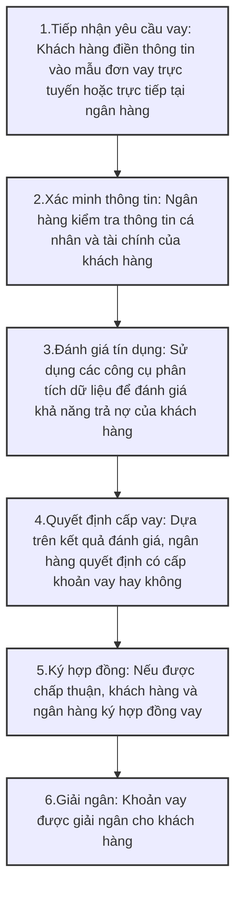

# Mục lục
## Phần 1 - Khái niệm & quy trình nghiệp vụ khởi tạo khoản vay LOS
## Phần 2 - Ứng dụng công nghệ RPA (Robotic Process Automation) trong quy trình khởi tạo khoản vay của FoxAI LOS
### 2.1.Outline slide trình bày
### 2.2.Nội dung chi tiết RPA tích hợp vào FoxAI LOS

---
# Phần 1 - Nghiệp vụ khởi tạo khoản vay LOS

## Quy trình nghiệp vụ
Khởi tạo khoản vay trong bối cảnh chuyển đổi số (digital transformation) là một quá trình quan trọng trong ngành tài chính, đặc biệt là trong lĩnh vực ngân hàng và cho vay. Dưới đây là một cái nhìn tổng quan về khái niệm này, các bước thực hiện, và lợi ích của việc áp dụng công nghệ số trong quy trình khởi tạo khoản vay.

### 1. Khái niệm Khởi tạo Khoản Vay
Khởi tạo khoản vay là quá trình mà khách hàng (cá nhân hoặc doanh nghiệp) yêu cầu một khoản vay từ ngân hàng hoặc tổ chức tài chính. Quá trình này bao gồm việc thu thập thông tin, đánh giá khả năng trả nợ, và quyết định cấp phát khoản vay.

### 2. Các Bước Khởi Tạo Khoản Vay
Quá trình khởi tạo khoản vay thường bao gồm các bước sau:


### 3. Chuyển Đổi Số trong Khởi Tạo Khoản Vay
Chuyển đổi số mang lại nhiều cải tiến cho quy trình khởi tạo khoản vay, bao gồm:
- Tự động hóa quy trình: Sử dụng phần mềm để tự động hóa các bước như tiếp nhận yêu cầu, xác minh thông tin, và đánh giá tín dụng.
- Phân tích dữ liệu lớn: Sử dụng phân tích dữ liệu để đánh giá rủi ro và khả năng trả nợ một cách chính xác hơn.
- Trải nghiệm khách hàng tốt hơn: Cung cấp giao diện người dùng thân thiện và dễ sử dụng cho khách hàng, giúp họ dễ dàng thực hiện các bước vay.
- Tiết kiệm thời gian: Giảm thiểu thời gian xử lý từ khi khách hàng yêu cầu vay đến khi khoản vay được giải ngân.
- Quản lý rủi ro hiệu quả: Sử dụng công nghệ để theo dõi và quản lý rủi ro liên quan đến khoản vay.

### 4. Lợi Ích của Chuyển Đổi Số trong Khởi Tạo Khoản Vay
- Tăng cường hiệu quả: Giảm thiểu thời gian và chi phí cho quy trình khởi tạo khoản vay.
- Cải thiện độ chính xác: Giảm thiểu sai sót do con người và tăng cường độ chính xác trong đánh giá tín dụng.
- Tăng cường khả năng cạnh tranh: Các ngân hàng và tổ chức tài chính có thể cung cấp dịch vụ nhanh chóng và hiệu quả hơn, thu hút nhiều khách hàng hơn.

---
## Phân biệt RLOS (Retail Loan Origination System) và CLOS (Commercial Loan Origination System) 
Đây là hai hệ thống quản lý quy trình khởi tạo khoản vay, nhưng chúng phục vụ cho các mục đích khác nhau và có những đặc điểm riêng biệt.

| **Tiêu chí**                  | **RLOS (Retail Loan Origination System)**                             | **CLOS (Commercial Loan Origination System)**                             |
|-------------------------------|----------------------------------------------------------------------|---------------------------------------------------------------------------|
| **Định nghĩa**                 | Hệ thống quản lý quy trình khởi tạo khoản vay cho khách hàng cá nhân như vay mua nhà, vay tiêu dùng, vay tín chấp. | Hệ thống quản lý quy trình khởi tạo khoản vay cho khách hàng doanh nghiệp như vay kinh doanh, vay đầu tư, tín dụng thương mại. |
| **Đối tượng Khách hàng**       | Hướng đến khách hàng cá nhân, bao gồm người tiêu dùng và hộ gia đình. | Hướng đến khách hàng doanh nghiệp, bao gồm công ty nhỏ, vừa và lớn. |
| **Quy trình Khởi tạo Khoản Vay** | Quy trình đơn giản và nhanh chóng với các bước điền đơn, xác minh thông tin cá nhân, và đánh giá tín dụng. | Quy trình phức tạp hơn với thu thập nhiều thông tin tài chính, phân tích rủi ro và đánh giá khả năng trả nợ của doanh nghiệp. |
| **Tính Năng và Công Cụ**      | Giao diện người dùng thân thiện, tự động hóa quy trình, tích hợp với các hệ thống thanh toán và quản lý khách hàng. | Các tính năng phức tạp như phân tích tài chính, quản lý tài sản thế chấp, theo dõi các khoản vay trong thời gian dài. |
| **Mục tiêu và Kết quả**       | Cung cấp trải nghiệm khách hàng tốt và xử lý nhanh chóng các khoản vay cá nhân. | Tối ưu hóa quy trình phê duyệt khoản vay cho doanh nghiệp, giảm thiểu rủi ro và đảm bảo hiệu quả trong việc cấp phát khoản vay. |

---

## Các ngành nghề kinh doanh được hỗ trợ

**1.Các khoản cho vay bán lẻ**
- Xử lý các khoản cho vay bán lẻ trên thị trường đại chúng thường có nghĩa là phải ứng phó với số lượng lớn các yêu cầu điển hình đối vớicác khoản vay tương đối nhỏ. Để xử lý hiệu quả luồng ứng dụng quan trọng và duy trì tính cạnh tranh, người cho vay cần tạo ra một nền tảng công nghệ đáng tin cậy có thể hỗ trợtự động hóa thủ tục khởi tạo khoản vay, quản lý rủi ro qua các danh mục tín dụng, nhanh chóng đưa ra quyết định cho vay, tạo sản phẩm mới và tùy chỉnh bảo hiểm khởi tạo thông minh.

**2.Các khoản cho vay kinh doanh**
- Trường hợp bộ phận cho vay của doanh nghiệp cung cấp các sản phẩm tín dụng tiêu chuẩn – khách hàng doanh nghiệp vay số lượng lớn hơn và yêu cầu phương pháp riêng hiếm khi xảy ra, và ngân hàng cần tùy chỉnh và đề xuất ra các giải pháp tốt nhất cho từng nhiệm vụ kinh doanh cụ thể. Mức độ rủi ro cao hơn do số tiền vay lớn hơn là một đặc thù quan trọng khác của hoạt động cho vay doanh nghiệp. Dựa vào giải pháp FOXAI LOS hiện đại để xử lý rủi ro đúng cách và cung cấp cho khách hàng của bạn các dịch vụ chất lượng cao cá nhân hóa.

**3.Các khoản cho vay SME**
- Các khoản cho vay Doanh nghiệp vừa và nhỏ tương đối nhỏ, nhưng chúng gây ra chi phí hành chính cao hơn và yêu cầu nguồn nhân lực nhiều hơn so với các hình thức cho vay khác. Nhiều chủ sở hữu của các doanh nghiệp vừa và nhỏ rất khó tiếp cận vì họ sinh sống ở các vùng nông thôn hẻo lánh. Ngoài ra, người cho vay phải xử lý nhiều thông tin tài chính để đưa ra quyết định đúng đắn và giảm thiểu rủi ro. Hợp lý hóa các thủ tục này, tiếp cận khách hàng từ xa và tạo thuận lợi cho toàn bộ quy trình cho vay Doanh nghiệp vừa và nhỏ với các công cụ và tính năng công nghệ hiện đại do FOXAI LOS cung cấp.

**4.Các khoản cho vay tài chính vi mô** 
- Dịch vụ tài chính vi mô cho các hộ nghèo và thu nhập thấp và các doanh nghiệp của họ, thường được gọi là doanh nghiệp siêu nhỏ, đóng một vai trò quan trọng trong việc giảm nghèo. Nắm bắt nhóm khách hàng rộng lớn này, tiếp cận khách hàng từ xa của bạn và thiết lập việc khởi tạo khoản vay một cách thông minh và các quy trình quản lý với nhiều công cụ tiên tiến nhất được cung cấp bởi giải pháp FOXAI LOS.

---
# Phần 2 - Ứng dụng công nghệ RPA (Robotic Process Automation) trong quy trình khởi tạo khoản vay của FoxAI LOS
## 2.1.Outline cho bài trình bày về chuyển đổi số trong ngành ngân hàng - Ứng dụng công nghệ RPA (Robotic Process Automation) trong quy trình khởi tạo khoản vay của FoxAI LOS
Bài trình bày này được chia thành nhiều slide với mục đích giúp người tham gia hiểu rõ các vấn đề và giải pháp công nghệ, cũng như kết quả thực tế của việc ứng dụng RPA trong ngân hàng, sử dụng một số công cụ AI như [UiPath](https://www.uipath.com/), [Blue Prism](https://www.blueprism.com/), [Automation Anywhere](https://www.automationanywhere.com/), [Kofax](https://www.kofax.com/), [WorkFusion](https://www.workfusion.com/)...

### Slide 1: Tiêu đề và Giới thiệu
- Tiêu đề: Chuyển Đổi Số Trong Ngành Ngân Hàng: Ứng Dụng RPA Trong Quy Trình Khởi Tạo Khoản Vay

- Giới thiệu ngắn gọn về mục tiêu bài học:

+ Tại sao chuyển đổi số quan trọng trong ngành ngân hàng?

+ Cách RPA có thể tối ưu hóa quy trình khởi tạo khoản vay.

### Slide 2: Giới thiệu về Chuyển Đổi Số trong Ngành Ngân Hàng
- Khái niệm chuyển đổi số: Tích hợp công nghệ số vào tất cả các lĩnh vực trong ngân hàng.

- Lợi ích của chuyển đổi số: Tăng hiệu quả, giảm chi phí, nâng cao trải nghiệm khách hàng, cải thiện sự tuân thủ và khả năng cạnh tranh.

### Slide 3: Pain Point của Ngành Ngân Hàng (Vấn Đề Đang Gặp Phải)
- Quy trình thủ công, tốn thời gian: Quản lý hồ sơ khách hàng, nhập liệu thủ công, xử lý giấy tờ (thường từ 5 đến 7 ngày).

- Khó khăn trong việc đảm bảo tính chính xác và tuân thủ: Các sai sót trong việc đánh giá tín dụng và kiểm tra thông tin khách hàng.

- Trải nghiệm khách hàng không tối ưu: Quá trình vay vốn kéo dài và thiếu minh bạch => Khách hàng không hài lòng vì chờ đợi lâu.

- Chi phí vận hành cao: Chi phí liên quan đến nhân sự và tài liệu.

### Slide 4: Quy Trình LOS – Khởi Tạo Khoản Vay
- Bước 1: Tiếp nhận yêu cầu vay: Xác định nhu cầu vay của khách hàng.

- Bước 2: Khởi tạo hồ sơ: Thu thập và nhập thông tin khách hàng.

- Bước 3: Xử lý hồ sơ: Đánh giá tín dụng và phân tích rủi ro.

- Bước 4: Ra quyết định cấp vay: Đánh giá và ra quyết định vay.

- Bước 5: Ký hợp đồng: Ký kết hợp đồng vay.

- Bước 6: Giải ngân khoản vay: Chuyển tiền cho khách hàng.

### Slide 5: Công Nghệ RPA (Robotic Process Automation)
- Khái niệm RPA: Là công nghệ tự động hóa quy trình bằng phần mềm (bot).

- Lợi ích của RPA:

+ Giảm thiểu công việc thủ công

+ Tăng năng suất và hiệu quả

+ Đảm bảo chính xác và tuân thủ

+ Cải thiện trải nghiệm khách hàng

### Slide 6: RPA Tích Hợp Trong FoxAI LOS – Hỗ Trợ Bước 1: Tiếp nhận yêu cầu vay:

- RPA tự động phân loại yêu cầu vay dựa trên thông tin đầu vào của khách hàng (chatbot, form trực tuyến).

- Tự động xác định sản phẩm vay phù hợp dựa trên thuật toán phân tích nhu cầu.


### Slide 7: RPA Tích Hợp Trong FoxAI LOS – Hỗ Trợ Bước 2: Khởi tạo hồ sơ:

- RPA sử dụng OCR (Optical Character Recognition) để quét và tự động nhập thông tin từ tài liệu giấy vào hệ thống.

- Xác minh thông tin khách hàng tự động từ các cơ sở dữ liệu.


### Slide 8: RPA Tích Hợp Trong FoxAI LOS – Hỗ Trợ Bước 3: Xử lý hồ sơ:

- RPA thực hiện pre-scoring và scoring tự động.

- Phân tích rủi ro từ dữ liệu tài chính của khách hàng để hỗ trợ quyết định vay.


### Slide 9: RPA Tích Hợp Trong FoxAI LOS – Hỗ Trợ Bước 4: Ra quyết định cấp vay:

- RPA đưa ra quyết định tự động hoặc hỗ trợ nhân viên ra quyết định dựa trên các quy tắc được lập trình sẵn và dữ liệu phân tích.


### Slide 10: RPA Tích Hợp Trong FoxAI LOS – Hỗ Trợ Bước 5: Ký hợp đồng:

- RPA tự động tạo và lưu trữ các hợp đồng vay.

- Tự động thông báo cho khách hàng qua email hoặc SMS.


### Slide 11: RPA Tích Hợp Trong FoxAI LOS – Hỗ Trợ Bước 6: Giải ngân khoản vay:

- RPA tự động tạo lệnh giải ngân và thực hiện thanh toán.

### Slide 12: Kết Quả Đo Lường và Tính Hiệu Quả
- Giảm thời gian xử lý đơn vay:

+ Thời gian xử lý giảm từ 5-7 ngày xuống còn 1-2 ngày.

+ Giảm 60-70% thời gian.

- Tăng tỷ lệ quyết định tự động:

+ 80% quyết định vay được xử lý tự động, giảm thiểu sự can thiệp của nhân viên.

- Giảm thiểu sai sót:

+ Tỷ lệ sai sót giảm từ 10-15% xuống chỉ còn 1-2%.

- Tăng cường sự hài lòng của khách hàng:

+ 40% sự hài lòng của khách hàng tăng lên nhờ quy trình nhanh chóng và chính xác.

- Tiết kiệm chi phí nhân sự:

+ Ngân hàng tiết kiệm được 30% chi phí nhân sự trong quy trình xử lý vay.

### Slide 13: Lợi Ích Tổng Thể của RPA Trong Ngành Ngân Hàng
Tăng hiệu quả công việc: Tiết kiệm thời gian và chi phí.

Cải thiện trải nghiệm khách hàng: Quy trình nhanh chóng, chính xác và minh bạch.

Tối ưu hóa quy trình và nâng cao năng suất: Tự động hóa các bước trong quy trình vay vốn.

Đảm bảo tuân thủ và giảm rủi ro: Giảm thiểu sai sót và tối ưu hóa tuân thủ quy định pháp lý.

Nâng cao khả năng cạnh tranh: Các ngân hàng có thể cung cấp dịch vụ nhanh chóng và hiệu quả hơn.

### Slide 14: Tương Lai Của Chuyển Đổi Số Trong Ngành Ngân Hàng
- Phát triển các công nghệ AI và RPA trong tất cả các quy trình ngân hàng.

- Tăng cường tự động hóa và tích hợp dữ liệu giữa các hệ thống ngân hàng.

- Sự đổi mới trong sản phẩm dịch vụ: Các sản phẩm tín dụng, cho vay được tùy chỉnh dựa trên dữ liệu khách hàng.

### Slide 15: Kết Luận
- Tầm quan trọng của chuyển đổi số trong ngân hàng: Là chìa khóa để nâng cao hiệu quả và khả năng cạnh tranh.

- RPA là công nghệ quan trọng giúp ngân hàng tự động hóa quy trình, giảm thiểu sai sót và nâng cao trải nghiệm khách hàng.

- Tương lai sáng sủa cho ngành ngân hàng với ứng dụng công nghệ cao và tự động hóa trong mọi quy trình.

### Slide 16: Hỏi Đáp và Thảo Luận
- Mở rộng thảo luận: Các câu hỏi từ khán giả về việc áp dụng công nghệ RPA vào quy trình LOS tại ngân hàng.

- Chia sẻ kinh nghiệm: Các ví dụ thực tế và triển khai thành công công nghệ RPA trong các ngân hàng khác.

---

## 2.2.Chi tiết các tính năng RPA trong FoxAI LOS
### 2.2.1.FoxAI LOS hỗ trợ cán bộ ngân hàng "Tư vấn cho khách hàng" trong bước "1.Tiếp nhận yêu cầu vay" (Slide 6)

- **Xác định nhu cầu của khách hàng:** Hiểu rõ yêu cầu vay của khách hàng để đưa ra giải pháp phù hợp.
```
- Về công cụ: RPA có thể tích hợp với các form trực tuyến hoặc chatbot (Chatbase, Dialogflow, ChatGPT) để thu thập thông tin chi tiết từ khách hàng về yêu cầu vay.

- Về Dữ liệu thu thập: Các thông tin cần thiết bao gồm mục đích vay, số tiền vay yêu cầu, thời gian vay, thu nhập, và các yếu tố tài chính khác.
Sau khi thu thập thông tin, hệ thống RPA có thể sử dụng quy tắc logic (Rule-based Logic) để phân loại và xử lý yêu cầu vay của khách hàng.
Ví dụ: Nếu khách hàng yêu cầu vay để mua nhà, hệ thống sẽ tự động nhận diện và đưa ra các sản phẩm vay thế chấp nhà ở. Nếu mục đích vay là vay tiêu dùng, hệ thống sẽ gợi ý các khoản vay tiêu dùng không cần tài sản thế chấp.

- Về Thuật toán phân tích: Các thuật toán phân loại (Classification Algorithms) như Decision Trees hoặc Random Forest có thể được áp dụng để phân loại mục đích vay và các yếu tố khác. Dựa vào các thuộc tính này, hệ thống sẽ xác định sản phẩm vay phù hợp.
Ví dụ: Dựa trên mức thu nhập của khách hàng, hệ thống có thể chọn ra các sản phẩm vay tiêu dùng hoặc vay mua ô tô với điều kiện tín dụng khác nhau.

- Hệ thống RPA có thể kết hợp với các công cụ phân tích dữ liệu lớn (Big Data tools) và các mô hình học máy (Machine Learning) để phân tích các hành vi và lịch sử tín dụng của khách hàng.
Ví dụ: Sử dụng các công cụ phân tích dữ liệu như Apache Spark, Hadoop, hoặc Python Pandas để xử lý và phân tích các dữ liệu lịch sử từ các khách hàng trước đó. Việc phân tích này có thể giúp dự đoán và hiểu rõ nhu cầu vay của khách hàng.
```

- **Lựa chọn các sản phẩm ngân hàng phù hợp:** Chọn sản phẩm vay thích hợp dựa trên nhu cầu và điều kiện của khách hàng.
```
- Hệ thống RPA có thể xác định các sản phẩm vay phù hợp từ danh sách sản phẩm của ngân hàng thông qua một quy trình kết hợp giữa RPA và các công cụ phân tích dữ liệu như thuật toán học máy (Machine Learning) và quy tắc (rule-based logic).

- Thứ nhất, các quy tắc cố định (rule-based) được lập trình sẵn để xác định các sản phẩm vay phù hợp. Các quy tắc này dựa trên những yếu tố cụ thể mà ngân hàng đã định sẵn.
Ví dụ:
+ Nếu mục đích vay là mua nhà, thì sản phẩm vay phù hợp có thể là vay thế chấp nhà ở.
+ Nếu mức thu nhập của khách hàng vượt quá một ngưỡng cụ thể (ví dụ: 20 triệu đồng/tháng), hệ thống có thể gợi ý các khoản vay vốn lưu động hoặc vay tiêu dùng với số tiền lớn hơn.

- Thứ hai, các thuật toán khuyến nghị bao gồm:
+ Collaborative Filtering: Dựa trên các đặc điểm tương tự của các khách hàng khác, hệ thống có thể gợi ý các sản phẩm vay phù hợp.
+ Content-Based Filtering: Dựa trên các đặc điểm của khách hàng (thu nhập, mục đích vay, khả năng trả nợ), hệ thống có thể gợi ý các khoản vay có kỳ hạn và lãi suất phù hợp dựa trên cấu trúc if-else.
+ Thuật toán phân loại (Classification Algorithm): Các thuật toán như Decision Trees hoặc Random Forest có thể được sử dụng để phân loại khách hàng vào các nhóm khác nhau (ví dụ: vay mua nhà, vay mua xe, vay tiêu dùng) dựa trên các yếu tố như thu nhập, lịch sử tín dụng và mục đích vay.

- Thứ ba, quy trình thực hiện:
+ Dữ liệu huấn luyện: Sử dụng dữ liệu lịch sử của khách hàng để huấn luyện mô hình học máy. Các thông tin như mức thu nhập, khoản vay trước đó, và sản phẩm vay mà họ đã chọn trước đây có thể được sử dụng để xây dựng mô hình.
+ Dự đoán sản phẩm vay: Sau khi mô hình học máy được huấn luyện, khi khách hàng cung cấp thông tin mới, hệ thống RPA sẽ sử dụng mô hình này để dự đoán và chọn sản phẩm vay phù hợp dựa trên các yếu tố của khách hàng.
```
- **Tính toán các thông số khoản vay bằng cách cấu hình việc tính toán khoản vay:** Tính toán các thông số cần thiết như lãi suất, thời gian vay, số tiền vay, v.v.
```
Hệ thống RPA sử dụng:
- Các công thức tài chính chuẩn như công thức tính lãi suất thông thường, lãi kép, Kỳ Hạn Vay (Amortization) và tổng chi phí vay (Total Loan Cost)...
- Các công cụ tài chính tích hợp như Python, LOS, Loan Calculator API... để tự động tính toán các thông số vay.
- Các nền tảng tài chính đám mây (Cloud-based Financial Services) như AWS, Google Cloud cũng cung cấp các công cụ để tính toán lãi suất và kỳ hạn vay cho ngân hàng.
Các công cụ và thuật toán này giúp giảm thiểu sai sót, tiết kiệm thời gian, và tối ưu hóa quy trình xử lý vay, tạo ra một hệ thống hiệu quả và chính xác.
```
- **Tạo ra đề nghị cho vay:** Soạn thảo và đưa ra các đề nghị vay cho khách hàng.
```
- Hệ thống RPA có thể sử dụng các công cụ soạn thảo văn bản tự động (như Google Docs API, Microsoft Word API) để tự động tạo ra các đề nghị vay dựa trên các thông tin đã thu thập từ khách hàng và các phân tích trước đó.
Ví dụ, nội dung văn bản có thể bao gồm các thông tin như số tiền vay, lãi suất, kỳ hạn vay, các điều kiện vay, và thông tin thanh toán hàng tháng.
- Cấu trúc của đề nghị vay sẽ được tùy chỉnh theo yêu cầu của ngân hàng và ngân hàng có thể cài đặt các mẫu văn bản chuẩn cho các loại vay khác nhau (vay mua nhà, vay tiêu dùng, v.v.).
Sau khi soạn thảo xong văn bản đề nghị vay, hệ thống có thể tự động gởi đi để khách hàng xác nhận hoặc ký hợp đồng vay, nếu ngân hàng yêu cầu chữ ký điện tử. Hệ thống có thể tích hợp với các công cụ ký hợp đồng điện tử như DocuSign hoặc Adobe Sign.
```
- **Đánh giá và đưa ra quyết định của khách hàng:** Đánh giá các yếu tố liên quan và đưa ra quyết định về khoản vay.
```
Hệ thống RPA có thể sử dụng quy tắc logic, mô hình học máy, và hệ thống quyết định tự động để đánh giá và đưa ra quyết định vay cho khách hàng.
Các công cụ và thuật toán này giúp tự động hóa quy trình ra quyết định, giảm thiểu sai sót, tiết kiệm thời gian và đảm bảo rằng khách hàng nhận được quyết định vay chính xác và công bằng.
```
---
### 2.2.2.FoxAI LOS hỗ trợ cán bộ ngân hàng "Khởi tạo hồ sơ" trong bước "2.Xác minh thông tin khách hàng" (Slide 7)

- **Nhập thông tin chi tiết về khách hàng:** Nhập các thông tin cụ thể và chi tiết của khách hàng vào hệ thống.
```
Khách hàng nộp các tài liệu hoặc chụp ảnh (CMND, hộ khẩu, giấy xác nhận thu nhập, v.v.).
Sử Dụng Công Nghệ Nhận Dạng Văn Bản (OCR) như FlexiCapture OCR, Kofax, Tesseract OCR...
Hệ thống OCR quét tài liệu và trích xuất các thông tin quan trọng như họ tên, số CMND, ngày cấp, địa chỉ, thông tin liên lạc, v.v.
Sau khi trích xuất, RPA tự động điền các thông tin vào hệ thống quản lý khách hàng của ngân hàng, giúp chuẩn bị hồ sơ vay.
```
- **Nhận dạng tài liệu:** Xác định và xử lý các tài liệu cần thiết cho hồ sơ vay.

- **Tập hợp trước các thông tin hồ sơ với dữ liệu từ máy tính:** Thu thập dữ liệu cần thiết từ hệ thống và máy tính để chuẩn bị hồ sơ vay.
```
- Kết nối hệ thống: RPA sẽ kết nối với các hệ thống ngân hàng như CRM hoặc LOS để thu thập các thông tin liên quan đến khách hàng, bao gồm các thông tin về khoản vay trước đó, tài sản thế chấp (nếu có), thu nhập, lịch sử tín dụng, v.v.
- Trích xuất dữ liệu: RPA sẽ tự động trích xuất các dữ liệu cần thiết từ các hệ thống ngân hàng (CRM, LOS) và chuẩn bị thông tin cho bước tiếp theo trong quy trình vay.
- Tập hợp hồ sơ vay: Sau khi dữ liệu được thu thập, RPA sẽ tự động điền thông tin vào các mẫu hồ sơ vay trong hệ thống ngân hàng, tạo ra một hồ sơ vay đầy đủ và chính xác.
```
- **Nhận dạng khách hàng:** Xác định thông tin khách hàng trước khi tiến hành khởi tạo hồ sơ vay.
```
- Xác Minh Danh Tính Khách Hàng Qua Cơ Sở Dữ Liệu hoặc kết nối tới các API tài chính như TrueLayer, Experian, FICO...
+ Trích xuất thông tin khách hàng: Sau khi RPA quét tài liệu giấy, hệ thống sẽ tự động thu thập và xử lý các thông tin liên quan đến khách hàng.
+ Kết nối API với các nguồn dữ liệu: Hệ thống RPA sẽ kết nối với các API tài chính như TrueLayer, Experian, FICO để xác minh danh tính khách hàng, so sánh các thông tin đã nhập với dữ liệu thực tế.
+ Xác minh: Nếu tất cả thông tin trùng khớp với dữ liệu trong hệ thống, hệ thống RPA sẽ tiếp tục bước tiếp theo trong quy trình khởi tạo hồ sơ vay. Nếu có sự không khớp, hệ thống sẽ yêu cầu xác minh thêm từ khách hàng.

- Xác Minh Thông Tin Khách Hàng Qua Công Nghệ Nhận Diện Khuôn Mặt (Facial Recognition) bởi các công cụ Amazon Rekognition, Face++, Microsoft Azure Face API...
+ Khách hàng chụp ảnh: Khách hàng sẽ sử dụng điện thoại hoặc máy tính để chụp ảnh khuôn mặt của mình.
+ So sánh ảnh: Hệ thống RPA sẽ sử dụng công cụ nhận diện khuôn mặt để so sánh hình ảnh này với ảnh trong tài liệu giấy của khách hàng (ví dụ: CMND hoặc hộ chiếu).
+ Xác minh thành công: Nếu khuôn mặt khớp với ảnh trong cơ sở dữ liệu, RPA sẽ tiếp tục xác minh thông tin và điền vào hồ sơ vay của khách hàng. Nếu không khớp, hệ thống sẽ yêu cầu khách hàng chụp lại ảnh hoặc cung cấp thêm thông tin.
```

- **Đính kèm bản sao điện tử của tài liệu:** Đính kèm bản sao điện tử của các tài liệu đã nhận vào hồ sơ vay.

---
### 2.2.3.FoxAI LOS hỗ trợ cán bộ ngân hàng "Xử lý hồ sơ" trong bước "3.Đánh giá tín dụng" (Slide 8)

- **Pre-scoring: Kiểm tra tự động để tuân thủ các yêu cầu của Ngân hàng, kiểm soát các yếu tố sử dụng và danh sách theo dõi, bao gồm kiểm tra AML (chống rửa tiền) và danh sách đen nội bộ.**
```
Hệ thống RPA có thể hỗ trợ Pre-scoring và đánh giá tín dụng bằng cách sử dụng các công cụ kiểm tra AML, kiểm tra danh sách đen, và mô hình phân tích rủi ro như Decision Trees, FICO Score, và Risk Scoring Models.
- RPA sử dụng các công cụ và thuật toán chống rửa tiền để kiểm tra các yếu tố liên quan đến rửa tiền trong quy trình Pre-scoring, bao gồm việc kiểm tra xem khách hàng có liên quan đến các tổ chức hoặc cá nhân bị liệt kê trong danh sách đen của ngân hàng hoặc các tổ chức tài chính quốc tế hay không thông qua:
+ Actimize AML (NICE Actimize): Đây là công cụ phổ biến trong việc kiểm tra rửa tiền (AML), có khả năng phân tích hành vi tài chính và phát hiện các dấu hiệu khả nghi, như giao dịch bất thường, chuyển tiền giữa các tài khoản hoặc tổ chức đáng ngờ.
+ World-Check (Refinitiv): Đây là công cụ giúp kiểm tra các cá nhân hoặc tổ chức có liên quan đến các danh sách đen như tổ chức tội phạm, danh sách của chính phủ hoặc các tổ chức có liên quan đến rửa tiền.
+ Algorithmic Risk Scoring: Sử dụng thuật toán như logistic regression hoặc decision trees để đánh giá các yếu tố rủi ro, xác định khả năng khách hàng tham gia vào các hoạt động rửa tiền.

- RPA tự động kiểm tra xem khách hàng có bị liệt kê trong danh sách đen nội bộ của ngân hàng hay không, như các khách hàng có lịch sử xấu về tín dụng, hoặc các khách hàng đã từng có các khoản vay không được thanh toán hoặc nợ xấu.
+ Custom Blacklist (Danh sách đen nội bộ): RPA có thể tích hợp với hệ thống Blacklists của ngân hàng, là nơi lưu trữ các cá nhân và tổ chức có vấn đề về tín dụng hoặc những khách hàng đã vi phạm các điều kiện của ngân hàng (số CMND, địa chỉ, số điện thoại, số tài khoản).
+ Decision Trees và Classification Models: Sử dụng các mô hình Decision Trees hoặc Random Forest để phân loại khách hàng vào các nhóm khác nhau, giúp hệ thống quyết định liệu khách hàng có nằm trong nhóm có rủi ro cao hay không dựa trên các yếu tố như lịch sử tín dụng, số lần nợ xấu, và mức độ tương tác trước đó với ngân hàng.
```

- **Scoring: Đánh giá điểm tín dụng của khách hàng.**
```
Hệ thống RPA có thể sử dụng các công cụ tín dụng (FICO, VantageScore), mô hình học máy (như Logistic Regression, Random Forest) và các công cụ phân tích rủi ro như SAS Credit Scoring, Oracle Credit Scoring để đánh giá điểm tín dụng của khách hàng trong quy trình scoring:
- Sử Dụng Các Thuật Toán Tính Điểm Tín Dụng (Credit Scoring Models):
+ FICO Score - công cụ tính điểm tín dụng phổ biến nhất, được sử dụng rộng rãi trong ngành ngân hàng và tài chính. Điểm tín dụng FICO được tính toán dựa trên 5 yếu tố chính: Lịch sử thanh toán (35%), Số dư nợ (30%), Lịch sử tín dụng (15%), Các loại tín dụng (10%), Mới mở tài khoản tín dụng (10%).
+ VantageScore là một hệ thống tính điểm tín dụng khác, tương tự như FICO, nhưng được phát triển bởi ba công ty tín dụng lớn là Experian, TransUnion, và Equifax.
+ Hệ thống RPA sử dụng các mô hình học máy (Machine Learning Models) như Random Forest, Logistic Regression, và XGBoost để tính toán điểm tín dụng dựa trên nhiều yếu tố tài chính.

- Tự Động Hóa Quy Trình Tính Điểm Tín Dụng:
+ Sử dụng các API tín dụng từ các công ty như Experian, FICO, hoặc TransUnion để thu thập và xử lý các dữ liệu tín dụng từ khách hàng.

- Tích Hợp Các Công Cụ Phân Tích Rủi Ro:
+ SAS Credit Scoring: SAS cung cấp các công cụ để tính toán điểm tín dụng dựa trên các yếu tố tài chính của khách hàng.
+ Oracle Credit Scoring: Công cụ này giúp phân tích dữ liệu tín dụng và tính toán điểm tín dụng dựa trên các yếu tố như lịch sử tín dụng, mức độ nợ, thu nhập, v.v.
```

- **Tính toán tự động các thang số khoản vay:** Tính toán tự động các thông số liên quan đến khoản vay, như mức độ tín dụng, khả năng trả nợ, v.v.
```
Hệ thống RPA sử dụng các công cụ tính toán điểm tín dụng, mô hình phân tích tài chính như FICO Score, VantageScore, Logistic Regression, Loan Amortization Calculators, và Risk-based Pricing để tính toán tự động các thang số khoản vay:
- Tính Toán Khả Năng Trả Nợ (Debt-to-Income Ratio - DTI):
+ Công thức tính DTI: Tỷ lệ DTI được tính bằng tổng số nợ phải trả của khách hàng chia cho thu nhập hàng tháng của khách hàng.
+ Thuật toán: Decision Trees có thể được sử dụng để phân loại khách hàng dựa trên các yếu tố tài chính, bao gồm DTI, thu nhập, và các khoản nợ. Thuật toán này giúp xác định mức độ phù hợp của khách hàng với các khoản vay.

- Tính Toán Các Điều Kiện Vay (Loan Terms):
+ Các công cụ như Loan Amortization Calculator API giúp tính toán số tiền thanh toán hàng tháng của khách hàng dựa trên số tiền vay, lãi suất và thời gian vay.
+ Các thuật toán để đánh giá rủi ro của khách hàng và tính toán các điều kiện vay: Risk-based pricing, Random Forest, XGBoost...
```
---
### 2.2.4.FoxAI LOS hỗ trợ cán bộ ngân hàng "Đưa ra quyết định" trong bước "4.Quyết định cấp vay" (Slide 9)

- **Hoàn toàn tự động hoặc quyết định thủ công:** Quyết định có thể được đưa ra tự động hoặc qua một quy trình thủ công dựa trên các thông tin và đánh giá sẵn có.
```
- Quyết Định Cấp Vay Tự Động (Automatic Loan Decisioning):
+ Decision Trees (Cây Quyết Định) giúp đưa ra quyết định dựa trên các yếu tố đầu vào như thu nhập, lịch sử tín dụng, tỷ lệ nợ, v.v.
+ Random Forest là một phương pháp học máy sử dụng nhiều cây quyết định để phân loại và đưa ra quyết định chính xác hơn.
+ Logistic Regression có thể được sử dụng để dự đoán xác suất khách hàng có khả năng trả nợ dựa trên các yếu tố tài chính như thu nhập, lịch sử tín dụng, v.v.

- Quyết Định Cấp Vay Qua Quy Trình Thủ Công (Manual Decisioning):
+ Business Rules Engine (BRE) giúp xác định các quy tắc và chính sách của ngân hàng để đưa ra quyết định cấp vay. BRE cho phép ngân hàng thiết lập các quy tắc cho việc cấp vay, như các yêu cầu về điểm tín dụng, tỷ lệ nợ thu nhập (DTI), hoặc các yêu cầu tài chính khác.
+ Decision Support Systems (DSS) là hệ thống hỗ trợ ra quyết định giúp ngân hàng phân tích dữ liệu và đưa ra quyết định vay dựa trên các tiêu chí đã được xác định trước.

- Quyết Định Cấp Vay Tùy Chỉnh (Custom Loan Decisioning):
+ Adaptive Decision Models (Mô Hình Quyết Định Thích Ứng) sử dụng các mô hình học máy để tạo ra các quyết định linh hoạt dựa trên các yếu tố đặc thù của khách hàng (ví dụ: khách hàng có điểm tín dụng thấp nhưng có tài sản thế chấp giá trị cao).
+ Credit Policy Engine (Công Cụ Chính Sách Tín Dụng) giúp ngân hàng thiết lập và duy trì các chính sách tín dụng để đưa ra quyết định vay phù hợp với chiến lược của ngân hàng.
```
- **Kiểm tra an ninh:** Đảm bảo các quy trình an ninh được tuân thủ trong quá trình xét duyệt.

- **Kiểm tra pháp lý:** Đảm bảo rằng khoản vay đáp ứng tất cả các yêu cầu pháp lý cần thiết.
```
- Kiểm Tra Tuân Thủ Quy Định Pháp Lý (Regulatory Compliance Check):
+ Regulatory Compliance Engines (Công Cụ Tuân Thủ Quy Định): Các công cụ như Thomson Reuters Compliance Learning, ComplyAdvantage, và Wolters Kluwer cung cấp các nền tảng để kiểm tra tuân thủ các quy định pháp lý và các yêu cầu liên quan đến các khoản vay, bao gồm các quy định về KYC (Know Your Customer), AML (Anti-Money Laundering), chống tài trợ khủng bố, và các luật tài chính khác.
- Kiểm Tra Tính Hợp Pháp của Tài Liệu (Document Legality Check)
- Kiểm Tra Điều Khoản Pháp Lý Của Hợp Đồng Vay (Contract Legal Term Verification):
+ Natural Language Processing (NLP) và Text Analytics: TextRazor, spaCy, IBM Watson NLP, và Google Cloud Natural Language có thể được sử dụng để phân tích và kiểm tra các điều khoản trong hợp đồng vay
- Kiểm Tra Tuân Thủ Quy Định Về Dữ Liệu Cá Nhân (Data Privacy Compliance)
```
- **Đánh giá rủi ro:** Đánh giá các yếu tố rủi ro liên quan đến khoản vay và khả năng trả nợ của khách hàng.
```
- Đánh Giá Rủi Ro Từ Các Tài Sản Thế Chấp (Collateral Risk Assessment):
+ Property Valuation Tools: Các công cụ định giá tài sản như Zillow, Kelley Blue Book (KBB) hoặc Redfin có thể cung cấp dữ liệu về giá trị của tài sản thế chấp, chẳng hạn như nhà cửa, đất đai, v.v.
+ Loan-to-Value Ratio (LTV): Loan-to-Value Ratio (LTV) là tỷ lệ giữa khoản vay và giá trị tài sản thế chấp. Nếu tỷ lệ LTV quá cao (thường > 80%), ngân hàng có thể yêu cầu tài sản thế chấp bổ sung hoặc giảm số tiền vay. Hệ thống RPA sẽ tự động tính toán và cảnh báo nếu tỷ lệ LTV vượt quá giới hạn cho phép.
+ Market Risk Models: Các công cụ phân tích rủi ro thị trường như Value-at-Risk (VaR) hoặc Monte Carlo Simulation có thể được sử dụng để dự đoán và đánh giá biến động giá trị tài sản trong tương lai.
+ Property and Title Verification Tools: Các công cụ như Title Insurance Verification và Property Title Search giúp xác minh tính hợp pháp của tài sản thế chấp.
```
- **Kiểm tra tài sản đảm bảo bởi Người quản lý Tài sản đảm bảo của ngân hàng:** Xác minh tài sản đảm bảo của khách hàng, đảm bảo rằng tài sản đủ giá trị để bảo vệ khoản vay.

- **Chỉnh sửa các thông số khoản vay bởi Tái thẩm định nhân viên:** Các thẩm định viên sẽ kiểm tra và chỉnh sửa thông số khoản vay nếu cần thiết.

- **Thông báo tới khách hàng về quyết định:** Thông báo cho khách hàng kết quả quyết định vay.
```
Hệ thống RPA hỗ trợ thông báo cho khách hàng về kết quả quyết định vay bằng cách tự động gửi thông báo thông qua các kênh giao tiếp như email, SMS, hoặc ứng dụng di động:
- Tự Động Gửi Thông Báo Qua Email và SMS: các dịch vụ MailChimp, SendGrid, Amazon SES hoặc SMTP Server để gửi email, các dịch vụ như Twilio, Nexmo, hoặc Plivo để gửi SMS.
- Tạo Thư Thông Báo Tự Động (Automated Notification Letters): DocuSign, HelloSign, hoặc Adobe Sign có thể được sử dụng để tạo và gửi các thư thông báo qua email cho khách hàng.
- Cập Nhật Trạng Thái Hồ Sơ Vay Và Thông Báo Qua Ứng Dụng Di Động (Mobile app)
- Gửi Thông Báo Quyết Định Vay Qua Hệ Thống Quản Lý Khách Hàng (CRM): Salesforce, HubSpot, Zoho CRM
- Gửi Thông Báo Qua Kênh Web Portal (Web-based Notification): Zendesk, Freshdesk
```
---
### 2.2.5.FoxAI LOS hỗ trợ cán bộ ngân hàng "Giải ngân khoản vay" trong bước "5.Ký hợp đồng" (Slide 10) & bước "6.Giải ngân" (Slide 11)

- **Tự động tạo hồ sơ khách hàng** trong hệ thống core banking.
```
- RPA tích hợp Integration with Core Banking System (CBS) thông qua công cụ: UiPath, Blue Prism, Automation Anywhere hoặc WorkFusion...
```
- **Tự động tạo hợp đồng cho vay** trong hệ thống cốt lõi core banking.

- **Tự động tạo thoả thuận tài sản đảm bảo** trong hệ thống core banking.
```
- Sau khi hợp đồng vay được ký kết, hệ thống RPA tự động tạo và lưu trữ các tài liệu hợp đồng vay vào hệ thống core banking thông qua công cụ: ABBYY FlexiCapture, Kofax, DocuSign để tự động quét, nhận diện và lưu trữ hợp đồng vay và các tài liệu liên quan vào Document Management Systems (DMS).
- RPA tự động đồng bộ hóa thông tin từ hồ sơ vay vào các hệ thống liên quan của ngân hàng: APIs từ Core Banking Systems (CBS) như Temenos, Finacle, hoặc Oracle FLEXCUBE
```
- **Mở tài khoản cho vay** trong hệ thống core banking.
```
Sau khi hồ sơ vay được tạo trong hệ thống core banking, RPA sẽ tự động tạo và gửi các yêu cầu giải ngân (lệnh thanh toán) tới các hệ thống thanh toán nội bộ hoặc đối tác thanh toán (ví dụ: chuyển khoản qua ngân hàng, dịch vụ thanh toán điện tử). RPA sẽ xác minh tính hợp lệ của lệnh thanh toán và đảm bảo rằng số tiền vay được chuyển đến đúng tài khoản khách hàng.
+ Automated Payment Authorization: Temenos Payment Suite, SWIFT, và RPA có thể tự động tạo và gửi yêu cầu giải ngân khoản vay qua hệ thống thanh toán của ngân hàng.
+ Tạo Báo Cáo và Theo Dõi Tiến Trình Giải Ngân bằng công cụ: Power BI, Tableau, QlikView...
```
- Ký hồ sơ tài liệu.

- Đính kèm tài liệu đã scan vào hồ sơ cho vay.

---
