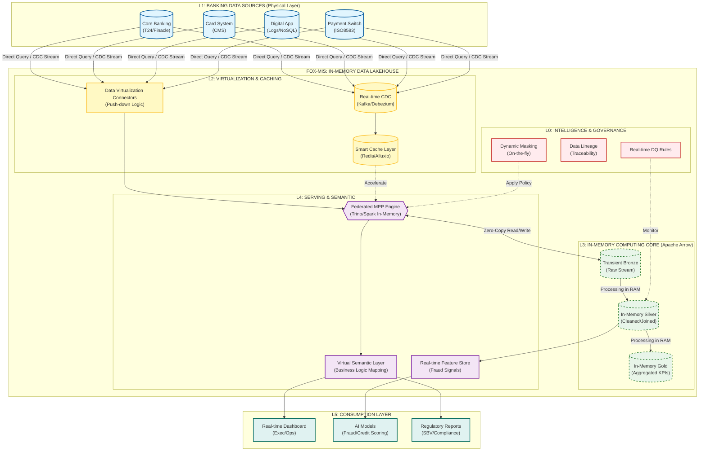

## Mục tiêu

Dựa trên tài liệu chuẩn hóa năng lực (Competency Framework) kết hợp với kiến trúc hệ thống **FOX-MIS** của công ty để xây dựng ra **Lộ trình đào tạo (Training Roadmap) dành cho Data Analyst (DA) tại FoxAI**.

Lộ trình này được thiết kế để biến một nhân sự từ "biết làm báo cáo" thành một **"Full-stack DA"** – người vừa vững kỹ thuật, vừa thấu hiểu nghiệp vụ và có tư duy sản phẩm (Product Mindset).

---

Kiến trúc **FOX-MIS In-Memory Data Lakehouse for Banking** này tập trung vào tính toán thời gian thực trong bộ nhớ (In-memory) và ảo hóa dữ liệu (Virtualize), do đó ưu tiên tốc độ xử lý và khả năng truy cập dữ liệu tức thì (near real-time) từ các hệ thống nguồn của ngân hàng, giảm thiểu lưu trữ vật lý trung gian.

#### 1. L1: NGÂN HÀNG DATA SOURCE LAYER (HỆ THỐNG NGUỒN)

Tầng này kết nối trực tiếp đến các hệ thống lõi của ngân hàng.

* **Core Banking System (T24, Finacle...):** Chứa dữ liệu tài khoản, giao dịch, sổ cái.
* **Card System (CMS):** Dữ liệu thẻ tín dụng, ghi nợ, giao dịch thẻ.
* **Digital Banking (ebank, mobile app):** Logs hoạt động người dùng, nhật ký giao dịch điện tử.
* **Loan Origination System (LOS):** Dữ liệu hồ sơ khoản vay, lịch trả nợ.
* **Payment Gateway/Switch:** Dữ liệu giao dịch thanh toán thời gian thực.

#### 2. L2: VIRTUAL INGESTION & CACHING LAYER (LỚP ẢO HÓA & ĐỆM)

Thay thế cho mô hình ETL truyền thống, tầng này tập trung vào kết nối thời gian thực và bộ nhớ đệm thông minh.

* **Real-time CDC (Change Data Capture):** Sử dụng công nghệ như Debezium kết hợp Kafka để bắt các thay đổi dữ liệu (ví dụ: một giao dịch mới vừa phát sinh) từ Core Banking ngay lập tức.
* **Data Virtualization Service:** Một lớp phần mềm cho phép định nghĩa các "bảng ảo" ánh xạ trực tiếp đến dữ liệu tại nguồn (Core, Card...). Các truy vấn sẽ được đẩy (push-down) xuống hệ thống nguồn để thực thi bất cứ khi nào có thể.
* **In-Memory Caching Layer (Alluxio/Redis):** Để giảm tải cho hệ thống Core Banking và tăng tốc độ phản hồi, các dữ liệu "nóng" (ví dụ: thông tin khách hàng VIP, số dư hiện tại) được lưu trữ tạm thời trên bộ nhớ RAM tốc độ cao.

#### 3. L3: IN-MEMORY LAKEHOUSE STORAGE (LỚP LƯU TRỮ TRÊN RAM)

Dữ liệu không được lưu trữ vĩnh viễn trên ổ cứng mà tồn tại chủ yếu trong bộ nhớ để xử lý.

* **In-Memory Format (Apache Arrow):** Dữ liệu được chuyển đổi sang định dạng cột tối ưu cho việc tính toán trong RAM, giúp chia sẻ dữ liệu giữa các hệ thống mà không cần sao chép (Zero-Copy).
* **Transient Bronze (Raw-in-RAM):** Dữ liệu thô từ nguồn được load lên RAM để xử lý nhanh.
* **In-Memory Silver (Cleaned-in-RAM):** Dữ liệu đã được làm sạch, chuẩn hóa ngay trong bộ nhớ.
* **In-Memory Gold (Aggregated-in-RAM):** Các chỉ số tổng hợp (ví dụ: Tổng giao dịch trong ngày của một chi nhánh) được tính toán và lưu trong RAM để phục vụ báo cáo tức thì.
* *(Tùy chọn) Persisted Storage (Delta Lake trên S3/HDFS): Chỉ sử dụng để lưu trữ lâu dài (Cold Data) phục vụ mục đích lịch sử hoặc tuân thủ quy định (Compliance), không dùng cho truy vấn thời gian thực.*

#### 4. L4: SERVING & SEMANTIC VIRTUALIZATION LAYER (LỚP PHỤC VỤ & NGỮ NGHĨA)

Lớp này cung cấp giao diện thống nhất cho người dùng và ứng dụng truy cập dữ liệu.

* **Federated MPP Query Engine (Trino/Presto trong chế độ In-Memory):** Đóng vai trò là "bộ não" xử lý truy vấn. Nó nhận yêu cầu từ người dùng, phân tách, gửi đến các nguồn hoặc cache, sau đó tổng hợp kết quả ngay trong RAM.
* **Virtual Semantic Layer:** Định nghĩa các mô hình nghiệp vụ ngân hàng (ví dụ: "Khách hàng", "Tài khoản", "Giao dịch") và các chỉ số KPI (ví dụ: NIM, CASA, NPL) một cách thống nhất, bất kể dữ liệu vật lý nằm ở đâu.
* **Real-time Feature Store (Redis/KeyDB):** Cung cấp các đặc trưng (features) được tính toán theo thời gian thực (ví dụ: số lần nhập sai PIN trong 5 phút qua) cho các mô hình AI phát hiện gian lận.

#### 5. L0: FOX-INTELLIGENCE & GOVERNANCE LAYER (LỚP QUẢN TRỊ THÔNG MINH)

Quản trị dữ liệu trong môi trường in-memory đòi hỏi kiểm soát chặt chẽ.

* **Dynamic Data Masking:** Che giấu dữ liệu nhạy cảm (ví dụ: số thẻ, số CCCD) ngay tức thì (on-the-fly) dựa trên quyền của người truy vấn.
* **Real-time Data Quality (DQ):** Giám sát chất lượng dữ liệu ngay khi nó chảy qua hệ thống (ví dụ: cảnh báo nếu có giao dịch với số tiền âm).
* **Data Catalog & Lineage:** Theo dõi nguồn gốc dữ liệu từ báo cáo ngược trở lại hệ thống nguồn, ngay cả khi dữ liệu không được lưu trữ vật lý.

#### 6. L5: CONSUMPTION LAYER (LỚP TIÊU DÙNG)

Các ứng dụng đầu cuối sử dụng dữ liệu tốc độ cao.

* **Real-time Exec Dashboards:** Các bảng điều khiển cho lãnh đạo ngân hàng thấy tình hình huy động vốn, cho vay theo thời gian thực (sử dụng chế độ DirectQuery).
* **AI/ML Applications (Fraud Detection, Credit Scoring):** Sử dụng dữ liệu từ Feature Store để đưa ra quyết định phê duyệt khoản vay hoặc chặn giao dịch gian lận trong tích tắc.
* **Regulatory Reporting:** Tạo các báo cáo tuân thủ (ví dụ: báo cáo Ngân hàng Nhà nước) trực tiếp từ dữ liệu nguồn được ảo hóa, đảm bảo tính chính xác và kịp thời.

---
---

# 📊 PHẦN 1: KHUNG NĂNG LỰC "THE VIRTUAL DATA ANALYST"

## 🎯 Mục tiêu (Objective)

* Khả năng truy vấn liên hợp (Federated Query) từ nhiều nguồn dữ liệu (Gov, Bank, CRM) mà không cần yêu cầu DE làm ETL.
* Xây dựng **Semantic Models** (Mô hình ngữ nghĩa) để định nghĩa các chỉ số kinh doanh (KPIs) ngay trên lớp ảo hóa.
* Tối ưu hóa câu lệnh SQL để chạy **In-Memory** mà không gây tràn RAM (OOM) hoặc treo hệ thống nguồn.
* Thiết kế Dashboard **Real-time** (Direct Query) thay vì Import Mode.

## 📚 Phương pháp luận (Thay đổi cốt lõi)
Việc chuyển đổi sang kiến trúc **In-Memory Data Lakehouse** và **Zero-Copy** sẽ thay đổi hoàn toàn cách Data Analyst (DA) tiếp cận dữ liệu.

DA tại FoxAI sẽ không còn là người "ngồi chờ dữ liệu đổ về kho" (Passive Consumer) mà là người **"Truy vấn trực tiếp tại nguồn thông qua lớp ảo hóa"** (Active Explorer). Họ cần tư duy tối ưu hóa bộ nhớ RAM và hiểu sâu về lớp ngữ nghĩa (Semantic Layer).

| Truy thống (Warehousing) | Hiện đại (FoxAI In-Memory Virtualization) |
| --- | --- |
| **Physical Tables:** Tạo bảng Fact/Dim vật lý. | **Logical Views:** Tạo bảng ảo (Virtual Views) ánh xạ từ nguồn. |
| **Batch Reporting:** Báo cáo dữ liệu hôm qua (T-1). | **Real-time Analytics:** Báo cáo dữ liệu ngay tại thời điểm query (T-0). |
| **ETL:** Extract - Transform - Load. | **ELT & Mapping:** Mapping logic nghiệp vụ ngay khi truy vấn. |
| **Storage Optimization:** Tiết kiệm ổ cứng. | **Compute Optimization:** Tiết kiệm RAM và CPU. |

## 🧰 Công cụ trọng tâm (DA Tech Stack)

| Nhóm công cụ | Công cụ tại FoxAI |
| --- | --- |
| **Query Engine** | **Trino (PrestoSQL)**: Viết SQL để query dữ liệu phân tán. |
| **BI Tool** | **Superset / Power BI (DirectQuery)**: Vẽ chart kết nối trực tiếp vào Trino. |
| **Semantic Layer** | **Cube.js** hoặc **Dbt (logic only)**: Nơi định nghĩa "Doanh thu" là gì, "Nợ xấu" là gì để tái sử dụng. |
| **Collaboration** | **Jupyter Notebook (SQL Kernel)**: Để phân tích ad-hoc. |

---

# 🚵 PHẦN 2: LỘ TRÌNH ĐÀO TẠO (12 TUẦN)

### GIAI ĐOẠN 1: TƯ DUY VIRTUALIZATION & QUERYING (Tuần 1 - 3)

*Mục tiêu: Hiểu cách "nhìn" thấy dữ liệu mà không cần "sở hữu" nó.*

* **Tuần 1: Kiến trúc In-Memory & Data Virtualization**
* Làm quen với khái niệm **Logical Data Warehouse**: Dữ liệu vẫn nằm ở Core Banking/Hệ thống Chính phủ, FoxAI chỉ ánh xạ về.
* Thực hành: Truy cập **Data Catalog** để xem các "bảng ảo" đã được DE map sẵn.
* Quy tắc "Zero-Copy": Tại sao không được download file CSV về máy cá nhân (Security risk)?

* **Tuần 2: SQL trên Trino (Presto)**
* Sự khác biệt giữa Trino SQL và SQL thường (ANSI SQL Standard).
* Kỹ thuật **Federated Join**: Viết 1 câu lệnh SQL join bảng *Dân cư* (từ MongoDB) với bảng *Thuế* (từ Oracle) ngay trong RAM.

* **Tuần 3: Semantic Layer Basics**
* Thay vì viết SQL dài dòng lặp lại, học cách định nghĩa **Metrics** (Chỉ số) trong lớp ngữ nghĩa.
* *Bài tập:* Định nghĩa chỉ số "Tỷ lệ hồ sơ eKYC thành công" sao cho cả team Marketing và team Tech đều dùng chung 1 công thức.

### GIAI ĐOẠN 2: PERFORMANCE & MEMORY OPTIMIZATION (Tuần 4 - 6)

*Mục tiêu: Query nhanh, thông minh và không làm sập hệ thống.*

* **Tuần 4: Kỹ thuật "Pushdown Predicate" (Sống còn)**
* **Nguyên lý:** Đẩy bộ lọc (WHERE clause) xuống tận DB nguồn.
* *Sai:* `SELECT * FROM BigTable` rồi mới filter trên BI tool (Chết RAM).
* *Đúng:* `SELECT * FROM BigTable WHERE Date = Today` (Nguồn lọc xong mới gửi data về RAM FoxAI).

* **Tuần 5: Tối ưu hóa Visualization (Direct Query)**
* Khi dùng PowerBI/Superset ở chế độ **Direct Query** (không nạp data vào model), mỗi cú click của sếp là 1 câu query gửi về hệ thống.
* Học cách thiết kế Dashboard để giảm số lượng query không cần thiết.
* Sử dụng Caching ở lớp BI.

* **Tuần 6: Xử lý dữ liệu JSON/Unstructured trong RAM**
* Dữ liệu từ App Logs thường là JSON. Học cách dùng hàm `JSON_EXTRACT` của Trino để bóc tách dữ liệu ngay trong bộ nhớ mà không cần chờ DE làm sạch.

### GIAI ĐOẠN 3: DOMAIN INSIGHTS & REAL-TIME ANALYTICS (Tuần 7 - 10)

*Mục tiêu: Phân tích nghiệp vụ trên dữ liệu sống (Live Data).*

* **Tuần 7: Fintech Domain - Real-time Fraud Analysis**
* Phân tích các mẫu giao dịch (Transaction Patterns) đang diễn ra.
* Xây dựng Dashboard theo dõi "Sức khỏe hệ thống thanh toán" thời gian thực.

* **Tuần 8: Gov Domain - Secure Analytics**
* Làm việc với dữ liệu bị **Masking** (Che giấu): Hiểu tại sao cột "Tên" lại hiện là `Nguyễn Văn *`.
* Phân tích thống kê trên dữ liệu đã mã hóa (Privacy-Preserving Analytics).

* **Tuần 9: Business Domain - Operational Efficiency**
* Theo dõi hiệu suất xử lý hồ sơ của nhân viên hành chính theo thời gian thực.
* Phát hiện điểm nghẽn (Bottleneck) trong quy trình ngay khi nó đang xảy ra.

### GIAI ĐOẠN 4: AI-DRIVEN ANALYTICS & CAPSTONE (Tuần 11 - 12)

*Mục tiêu: DA biết dùng AI để tăng tốc độ phân tích.*

* **Tuần 11: Text-to-SQL & AI Assistant**
* Đào tạo cách sử dụng Chatbot nội bộ (FoxAI Chat) để hỏi: *"Cho tôi biết doanh thu hôm nay"* -> AI tự sinh câu lệnh Trino SQL.
* DA đóng vai trò người kiểm tra (Validator) xem AI viết SQL có tối ưu hay không.

* **Tuần 12: Capstone Project (In-Memory)**
* *Đề bài:* Xây dựng "Live Command Center" (Trung tâm chỉ huy) cho dự án Thành phố thông minh.
* *Yêu cầu:*
1. Dashboard cập nhật mỗi 5 giây (Near Real-time).
2. Kết nối 3 nguồn dữ liệu khác nhau.
3. Không lưu trữ dữ liệu trung gian.
4. Thời gian load Dashboard < 3s.
5. Có phân quyền (Sếp thấy hết, Nhân viên thấy một phần).

---

### 📝 TIÊU CHÍ ĐÁNH GIÁ (KPIs CHO DA)

1. **Query Efficiency:** Câu lệnh SQL viết ra tốn bao nhiêu RAM? (Trino có hiện thông số này).
2. **Dashboard Performance:** Thời gian load dashboard ở chế độ Direct Query.
3. **Semantic Contribution:** Số lượng Metrics chuẩn hóa đã đóng góp vào kho Semantic chung.
4. **Insight Freshness:** Khả năng phát hiện vấn đề ngay khi nó vừa xảy ra (nhờ tận dụng Real-time) thay vì báo cáo vào cuối tuần.

---
---

## Kiến trúc cũ dựa theo Data Warehousing

### 🚵 LỘ TRÌNH ĐÀO TẠO DATA ANALYST FOXAI (12 TUẦN)

#### GIAI ĐOẠN 1: FOUNDATION & SYSTEM INTEGRATION (Tuần 1 - 3)

*Mục tiêu: Hiểu văn hóa, nắm vững kiến trúc dữ liệu Fox-MIS và quy chuẩn báo cáo.*

**Tuần 1: Hội nhập & Kiến trúc dữ liệu (The Ecosystem)**

* **Văn hóa & Mindset:**
* Thấm nhuần tư duy **Client-Centric** & **Problem-first**: Không vội vã "nhảy" vào làm dashboard ngay, phải đặt câu hỏi "Tại sao cần báo cáo này?".
* Tìm hiểu về các Domain chính: Fintech, Gov, Business (ERP/SCM).

* **Hệ thống FOX-MIS:**
* Hiểu luồng dữ liệu (Data Lineage) từ L1 (Source) -> L3 (Lakehouse) -> L5 (Consumption).
* Cách sử dụng **Datahub (Data Governance)** để tra cứu Data Dictionary.

* **Công cụ (Toolset Setup):**
* Cài đặt và kết nối: DBeaver (cho SQL), Power BI/Tableau/Looker.
* Quy định bảo mật: Phân quyền truy cập (RBAC), quy tắc che giấu dữ liệu nhạy cảm (PII) trong Gov/Fintech.

**Tuần 2-3: SQL Nâng cao & Data Modeling (The Backbone)**

* **Advanced SQL (trên nền tảng Trino/Presto):**
* Thực hành tối ưu hóa truy vấn trên Big Data (tránh `SELECT *`, xử lý Partition).
* Master các kỹ thuật: `WINDOW FUNCTIONS`, `CTEs`, `Advanced JOINs`, xử lý `JSON/Array` (thường gặp trong Event logs).

* **Data Modeling:**
* Lý thuyết & Thực hành: Xây dựng **Star Schema** & **Snowflake Schema**.
* Hiểu bản chất bảng **Fact** (Sự kiện) vs **Dimension** (Chiều dữ liệu).
* Bài tập: Thiết kế Data Model cho một module nhỏ (ví dụ: Theo dõi giao dịch ngân hàng).

---

#### GIAI ĐOẠN 2: VISUALIZATION & BI MASTERY (Tuần 4 - 7)

*Mục tiêu: Xây dựng Dashboard không chỉ đẹp mà còn "thông minh", tuân thủ quy trình BI Lifecycle.*

**Tuần 4-5: Dashboard Design & UX/UI (The Art)**

* **Nguyên lý thiết kế:**
* Học về **Minimalism**: Loại bỏ "rác" (chart junk) trên biểu đồ.
* Tư duy **Drill-down**: Thiết kế báo cáo tầng lớp (Tổng quan -> Chi tiết -> Raw Data).

* **Thực hành Công cụ BI:**
* Xử lý Dynamic Parameters & Filters.
* Viết các hàm tính toán phức tạp (DAX trong Power BI hoặc LOD trong Tableau).
* Mapping KPI: Chuyển đổi yêu cầu nghiệp vụ (ví dụ: Tỷ lệ rời bỏ - Churn Rate) thành công thức kỹ thuật.

**Tuần 6-7: Quy trình triển khai dự án BI (The Process)**

* **BI Lifecycle thực chiến:**
* Thực hành quy trình: Khảo sát (Requirement) -> Mockup (Figma) -> Build -> Test -> Deploy.
* Viết tài liệu: **Technical Spec** (cấu trúc bảng) và **User Manual** (hướng dẫn sử dụng).

* **Tự động hóa (Automation):**
* Thiết lập lịch làm mới dữ liệu (Scheduled Refresh).
* Cấu hình cảnh báo (Data Alerts) khi chỉ số vượt ngưỡng (ví dụ: Server quá tải, Doanh thu tụt giảm đột ngột).

---

#### GIAI ĐOẠN 3: DOMAIN ANALYTICS & PRODUCT MINDSET (Tuần 8 - 10)

*Mục tiêu: Phân tích sâu, đưa ra Insight có giá trị hành động (Actionable Insight).*

**Tuần 8: Fintech & Business Analytics**

* **Fintech Domain:**
* Phân tích rủi ro tín dụng (Credit Scoring logic).
* Phân tích phát hiện gian lận (Fraud patterns).

* **Business Metrics:**
* Đọc hiểu P&L, Cashflow.
* Phân tích hiệu quả kinh doanh: Customer Lifetime Value (LTV), Customer Acquisition Cost (CAC).

**Tuần 9: Gov & Public Sector Analytics**

* **Đặc thù dữ liệu công:**
* Quy chuẩn báo cáo Chính phủ (nghiêm ngặt về format).
* Phân tích nhân khẩu học và dịch vụ công trực tuyến.

* **Data Quality (DQ):**
* Thực hiện kiểm tra chất lượng dữ liệu (Null check, Outlier detection) cho dữ liệu hành chính.

**Tuần 10: Product Analytics & A/B Testing**

* **Product Mindset:**
* Phân tích **Funnel** (Phễu chuyển đổi) và **Retention** (Tỷ lệ giữ chân).
* Phân tích hành vi người dùng (User Behavior) từ Event Logs.

* **A/B Testing:**
* Hiểu cách thiết kế thí nghiệm, kiểm định thống kê (Statistical Significance) để kết luận tính năng mới có hiệu quả hay không.

---

#### GIAI ĐOẠN 4: AI AUGMENTATION & GRADUATION (Tuần 11 - 12)

*Mục tiêu: Tích hợp sức mạnh AI vào công việc phân tích.*

**Tuần 11: Python & AI Integration**

* **Python for DA:**
* Sử dụng Pandas/Numpy cho EDA (Exploratory Data Analysis) nâng cao.
* Sử dụng thư viện Visualization (Seaborn/Matplotlib) cho các chart mà BI tool không vẽ được.

* **AI Support:**
* Sử dụng **NotebookLM** hoặc **ChatGPT** để hỗ trợ viết SQL, giải thích code, và tóm tắt insight từ dữ liệu thô.
* Hiểu cơ bản về **RAG** để hỗ trợ team AI Engineer chuẩn bị dữ liệu cho Chatbot.

**Tuần 12: Capstone Project & Defense**

* **Đồ án tốt nghiệp:** Thực hiện một dự án "Full-cycle" từ A-Z.
* *Đề bài:* Xây dựng Dashboard điều hành cho dự án FoxAI Native (theo dõi người dùng đăng ký, tỷ lệ eKYC thành công, lỗi hệ thống...).
* *Yêu cầu:* Phải có Mockup, Data Model, Dashboard hoàn chỉnh, Slide phân tích Insight và đề xuất hành động.

* **Đánh giá:** Dựa trên bộ OKRs (KR1.1 -> KR4.4) đã thiết lập.

---

### 📝 BỘ TÀI LIỆU CẦN CHUẨN BỊ CHO KHÓA ĐÀO TẠO

Để roadmap này chạy mượt mà, team  DA cần chuẩn bị sẵn các tài liệu sau (lưu trong NotebookLM để tra cứu):

1. **FoxAI Data Dictionary:** Từ điển định nghĩa các bảng, các trường trong Data Warehouse.
2. **KPI Library:** Danh sách định nghĩa chuẩn của các chỉ số (VD: Cách tính Churn Rate tại FoxAI là gì?).
3. **Dashboard Template:** File mẫu PowerBI/Looker đã có sẵn Theme, Logo, Header/Footer chuẩn của FoxAI.
4. **SQL Cheat Sheet:** Các đoạn code mẫu (Snippet) thường dùng cho hệ thống Fox-MIS.
5. **Checklist Triển khai:** File Excel kiểm tra các bước trước khi bàn giao dashboard cho khách hàng.

