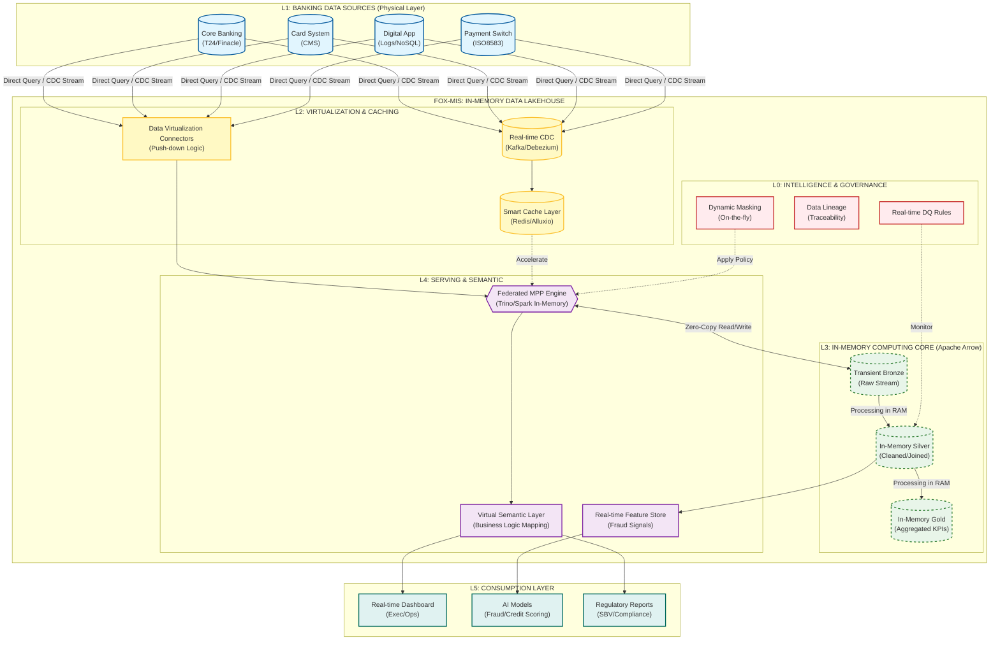

# KIẾN TRÚC DATA HỆ THỐNG FOX-MIS

---

Kiến trúc **FOX-MIS In-Memory Data Lakehouse for Banking** này tập trung vào tính toán thời gian thực trong bộ nhớ (In-memory) và ảo hóa dữ liệu (Virtualize), do đó ưu tiên tốc độ xử lý và khả năng truy cập dữ liệu tức thì (near real-time) từ các hệ thống nguồn của ngân hàng, giảm thiểu lưu trữ vật lý trung gian.

#### 1. L1: NGÂN HÀNG DATA SOURCE LAYER (HỆ THỐNG NGUỒN)

Tầng này kết nối trực tiếp đến các hệ thống lõi của ngân hàng.

* **Core Banking System (T24, Finacle...):** Chứa dữ liệu tài khoản, giao dịch, sổ cái.
* **Card System (CMS):** Dữ liệu thẻ tín dụng, ghi nợ, giao dịch thẻ.
* **Digital Banking (ebank, mobile app):** Logs hoạt động người dùng, nhật ký giao dịch điện tử.
* **Loan Origination System (LOS):** Dữ liệu hồ sơ khoản vay, lịch trả nợ.
* **Payment Gateway/Switch:** Dữ liệu giao dịch thanh toán thời gian thực.

#### 2. L2: VIRTUAL INGESTION & CACHING LAYER (LỚP ẢO HÓA & ĐỆM)

Thay thế cho mô hình ETL truyền thống, tầng này tập trung vào kết nối thời gian thực và bộ nhớ đệm thông minh.

* **Real-time CDC (Change Data Capture):** Sử dụng công nghệ như Debezium kết hợp Kafka để bắt các thay đổi dữ liệu (ví dụ: một giao dịch mới vừa phát sinh) từ Core Banking ngay lập tức.
* **Data Virtualization Service:** Một lớp phần mềm cho phép định nghĩa các "bảng ảo" ánh xạ trực tiếp đến dữ liệu tại nguồn (Core, Card...). Các truy vấn sẽ được đẩy (push-down) xuống hệ thống nguồn để thực thi bất cứ khi nào có thể.
* **In-Memory Caching Layer (Alluxio/Redis):** Để giảm tải cho hệ thống Core Banking và tăng tốc độ phản hồi, các dữ liệu "nóng" (ví dụ: thông tin khách hàng VIP, số dư hiện tại) được lưu trữ tạm thời trên bộ nhớ RAM tốc độ cao.

#### 3. L3: IN-MEMORY LAKEHOUSE STORAGE (LỚP LƯU TRỮ TRÊN RAM)

Dữ liệu không được lưu trữ vĩnh viễn trên ổ cứng mà tồn tại chủ yếu trong bộ nhớ để xử lý.

* **In-Memory Format (Apache Arrow):** Dữ liệu được chuyển đổi sang định dạng cột tối ưu cho việc tính toán trong RAM, giúp chia sẻ dữ liệu giữa các hệ thống mà không cần sao chép (Zero-Copy).
* **Transient Bronze (Raw-in-RAM):** Dữ liệu thô từ nguồn được load lên RAM để xử lý nhanh.
* **In-Memory Silver (Cleaned-in-RAM):** Dữ liệu đã được làm sạch, chuẩn hóa ngay trong bộ nhớ.
* **In-Memory Gold (Aggregated-in-RAM):** Các chỉ số tổng hợp (ví dụ: Tổng giao dịch trong ngày của một chi nhánh) được tính toán và lưu trong RAM để phục vụ báo cáo tức thì.
* *(Tùy chọn) Persisted Storage (Delta Lake trên S3/HDFS): Chỉ sử dụng để lưu trữ lâu dài (Cold Data) phục vụ mục đích lịch sử hoặc tuân thủ quy định (Compliance), không dùng cho truy vấn thời gian thực.*

#### 4. L4: SERVING & SEMANTIC VIRTUALIZATION LAYER (LỚP PHỤC VỤ & NGỮ NGHĨA)

Lớp này cung cấp giao diện thống nhất cho người dùng và ứng dụng truy cập dữ liệu.

* **Federated MPP Query Engine (Trino/Presto trong chế độ In-Memory):** Đóng vai trò là "bộ não" xử lý truy vấn. Nó nhận yêu cầu từ người dùng, phân tách, gửi đến các nguồn hoặc cache, sau đó tổng hợp kết quả ngay trong RAM.
* **Virtual Semantic Layer:** Định nghĩa các mô hình nghiệp vụ ngân hàng (ví dụ: "Khách hàng", "Tài khoản", "Giao dịch") và các chỉ số KPI (ví dụ: NIM, CASA, NPL) một cách thống nhất, bất kể dữ liệu vật lý nằm ở đâu.
* **Real-time Feature Store (Redis/KeyDB):** Cung cấp các đặc trưng (features) được tính toán theo thời gian thực (ví dụ: số lần nhập sai PIN trong 5 phút qua) cho các mô hình AI phát hiện gian lận.

#### 5. L0: FOX-INTELLIGENCE & GOVERNANCE LAYER (LỚP QUẢN TRỊ THÔNG MINH)

Quản trị dữ liệu trong môi trường in-memory đòi hỏi kiểm soát chặt chẽ.

* **Dynamic Data Masking:** Che giấu dữ liệu nhạy cảm (ví dụ: số thẻ, số CCCD) ngay tức thì (on-the-fly) dựa trên quyền của người truy vấn.
* **Real-time Data Quality (DQ):** Giám sát chất lượng dữ liệu ngay khi nó chảy qua hệ thống (ví dụ: cảnh báo nếu có giao dịch với số tiền âm).
* **Data Catalog & Lineage:** Theo dõi nguồn gốc dữ liệu từ báo cáo ngược trở lại hệ thống nguồn, ngay cả khi dữ liệu không được lưu trữ vật lý.

#### 6. L5: CONSUMPTION LAYER (LỚP TIÊU DÙNG)

Các ứng dụng đầu cuối sử dụng dữ liệu tốc độ cao.

* **Real-time Exec Dashboards:** Các bảng điều khiển cho lãnh đạo ngân hàng thấy tình hình huy động vốn, cho vay theo thời gian thực (sử dụng chế độ DirectQuery).
* **AI/ML Applications (Fraud Detection, Credit Scoring):** Sử dụng dữ liệu từ Feature Store để đưa ra quyết định phê duyệt khoản vay hoặc chặn giao dịch gian lận trong tích tắc.
* **Regulatory Reporting:** Tạo các báo cáo tuân thủ (ví dụ: báo cáo Ngân hàng Nhà nước) trực tiếp từ dữ liệu nguồn được ảo hóa, đảm bảo tính chính xác và kịp thời.

---
---

# 🏗️ PHẦN 1: KHUNG NĂNG LỰC "MODERN DATA ENGINEER" (VIRTUALIZATION FOCUS)

## 🎯 Mục tiêu (Objective)

* Xây dựng tầng **Data Virtualization** để kết nối và truy vấn trực tiếp từ nhiều nguồn (Gov DB, Bank Core, ERP) mà không sao chép dữ liệu vật lý.
* Tối ưu hóa các Engine tính toán **In-Memory** để xử lý dữ liệu ngay trong RAM với tốc độ cực nhanh.
* Thiết kế lớp **Semantic Mapping** (Ánh xạ ngữ nghĩa) để biến dữ liệu thô từ nguồn thành dữ liệu nghiệp vụ theo thời gian thực.
* Quản lý chiến lược Caching thông minh để giảm tải cho hệ thống nguồn.

## 📚 Phương pháp luận (Lý thuyết cốt lõi)

Việc chuyển từ mô hình "Hút - Đẩy" (ETL/ELT) truyền thống sang mô hình **Data Virtualization & In-Memory Computing** (Ảo hóa dữ liệu & Tính toán trong RAM) sẽ thay đổi hoàn toàn vai trò của Data Engineer tại FoxAI.

Lúc này, DE không còn là "công nhân bốc vác dữ liệu" (di chuyển data từ A sang B) mà trở thành **"Kỹ sư tối ưu hóa đường truyền và bộ nhớ"**.

| Chủ đề | Nội dung thay đổi so với truyền thống |
| --- | --- |
| **Data Virtualization** | Thay vì ETL, tập trung vào **Federated Query** (Truy vấn liên hợp) và **Logical Data Warehouse**. |
| **In-Memory Computing** | Xử lý dữ liệu dựa trên Columnar Format trong RAM (như **Apache Arrow**) thay vì đọc/ghi ổ cứng. |
| **Query Pushdown** | Đẩy logic tính toán xuống tận nguồn dữ liệu (Source System) để giảm lượng data phải truyền qua mạng. |
| **Zero-Copy Architecture** | Không nhân bản dữ liệu. Dữ liệu nằm đâu thì ở yên đó, chỉ kéo về khi người dùng query. |
| **Smart Caching** | Sử dụng bộ nhớ đệm (Alluxio/Redis) để lưu kết quả tạm thời thay vì lưu trữ vĩnh viễn. |

## 🧰 Công cụ trọng tâm (Tech Stack Updated)

| Nhóm công cụ | Công cụ phù hợp kiến trúc In-Memory/Virtualization |
| --- | --- |
| **Federated Query Engine** | **Trino (PrestoSQL)** hoặc **Starburst**: Trái tim của hệ thống, cho phép query mọi nguồn như một DB duy nhất. |
| **In-Memory Format** | **Apache Arrow**: Chuẩn format dữ liệu trong RAM để trao đổi giữa các hệ thống với tốc độ Zero-copy. |
| **Compute Engine** | **Apache Spark (In-Memory mode)**: Dùng để tính toán phức tạp (ML/AI) trên dữ liệu ảo hóa. |
| **Caching Layer** | **Alluxio** hoặc **Ignite**: Lớp đệm bộ nhớ giúp tăng tốc truy cập dữ liệu từ các nguồn chậm (Gov legacy DB). |
| **Virtualization Layer** | **Denodo** (Enterprise) hoặc setup custom mapping qua Trino Views. |

---

# 🚵 PHẦN 2: LỘ TRÌNH ĐÀO TẠO (12 TUẦN) - "THE ZERO-COPY ENGINEER"

### GIAI ĐOẠN 1: TƯ DUY VIRTUALIZATION & QUERY FEDERATION (Tuần 1 - 3)

*Mục tiêu: Quên đi tư duy ETL truyền thống. Học cách kết nối và ánh xạ.*

* **Tuần 1: Kiến trúc Zero-Copy & Trino Setup**
* **Mindset Shift:** Tại sao không nên lưu trữ? (Cost, Freshness, Privacy).
* **Trino/Presto Architecture:** Hiểu về Coordinator và Worker. Cấu hình Connectors tới PostgreSQL, Oracle, MongoDB.
* **Mapping Practice:** Thực hành tạo "Bảng ảo" (Views) ánh xạ tới dữ liệu thật mà không di chuyển 1 byte nào.

* **Tuần 2: Query Federation (Truy vấn liên hợp)**
* Kỹ thuật **JOIN đa nguồn:** Viết query JOIN bảng User (từ SQL Server) với bảng Logs (từ ElasticSearch) ngay trên RAM.
* Xử lý **Data Type Mapping:** Làm sao để ép kiểu dữ liệu từ các nguồn khác nhau về chuẩn chung của FoxAI.

* **Tuần 3: Query Optimization (Pushdown Predicates)**
* Đây là kỹ năng sống còn. Học cách viết query sao cho Trino "đẩy" việc lọc (Filter) xuống DB nguồn.
* *Ví dụ:* Không được `SELECT *` rồi mới lọc. Phải lọc ngay tại câu lệnh gửi đi.

### GIAI ĐOẠN 2: IN-MEMORY COMPUTING & PERFORMANCE (Tuần 4 - 7)

*Mục tiêu: Xử lý dữ liệu trong RAM. Tốc độ là tất cả.*

* **Tuần 4: Apache Arrow & Columnar Processing**
* Hiểu cấu trúc bộ nhớ của **Apache Arrow**.
* Tại sao xử lý theo cột (Columnar) trong RAM lại nhanh hơn theo dòng?
* Tối ưu hóa việc trao đổi dữ liệu giữa Python (Pandas) và JVM (Java/Scala) bằng Arrow (tránh serialize/deserialize).

* **Tuần 5: Spark In-Memory Optimization**
* Cấu hình Spark để chạy hoàn toàn trên RAM (Off-heap memory).
* Quản lý bộ nhớ (Memory Management): Phân chia vùng nhớ Storage vs Execution để tránh lỗi OutOfMemory (OOM).
* Kỹ thuật **Broadcast Hash Join** để join các bảng mapping nhỏ vào bảng lớn ngay trong RAM.

* **Tuần 6-7: Caching Strategy (Lớp đệm thông minh)**
* Khi nguồn (DB Chính phủ) quá chậm, ta làm gì? -> Triển khai **Alluxio** hoặc **Redis** làm lớp đệm.
* Thiết lập chính sách Caching: TTL (Time to Live), LRU (Least Recently Used).
* *Bài tập:* Cấu hình Cache để các báo cáo Dashboard chạy < 3s dù DB nguồn mất 30s để phản hồi.

### GIAI ĐOẠN 3: SECURITY & GOVERNANCE TRONG MÔ HÌNH ẢO HÓA (Tuần 8 - 10)

*Mục tiêu: Bảo mật tuyệt đối vì chúng ta đang chọc trực tiếp vào nguồn.*

* **Tuần 8: Dynamic Data Masking (Che giấu động)**
* Vì không lưu trữ, việc che dữ liệu phải diễn ra "On-the-fly" (ngay khi query).
* Cấu hình Trino/Ranger để: Khi User A query thấy đủ số CCCD, User B query chỉ thấy `***123`.

* **Tuần 9: Access Control & Audit Log**
* Quản lý định danh tập trung (SSO/LDAP).
* Ghi log ai đã query cái gì vào lúc nào (Audit Trail) - Cực quan trọng cho dự án Gov/Bank.

* **Tuần 10: Metadata Management (Datahub)**
* Vì không có bảng vật lý, việc quản lý Metadata của các "Bảng ảo" là cực kỳ quan trọng để DA/DS biết đường tìm dữ liệu.

### GIAI ĐOẠN 4: HỖ TRỢ AI & THỰC CHIẾN (Tuần 11 - 12)

*Mục tiêu: Phục vụ In-memory data cho AI Model.*

* **Tuần 11: Feature Serving (Online Store)**
* Sử dụng **Redis/Key-DB** để phục vụ các biến số (features) cho AI model dự đoán realtime.
* Pipeline tính toán feature trong RAM (Spark Streaming) và đẩy thẳng vào Redis (bỏ qua bước lưu ổ cứng).

* **Tuần 12: Capstone Project (Zero-Copy)**
* *Đề bài:* Xây dựng hệ thống báo cáo "Real-time Citizen 360" cho dự án Hành chính công.
* *Yêu cầu:*
1. Kết nối tới 3 nguồn giả lập (Công an, Thuế, Bảo hiểm).
2. Không được sao chép dữ liệu.
3. Khi user query tên công dân -> Trả về thông tin tổng hợp trong < 2s.
4. Tự động che giấu số điện thoại nếu user không có quyền.
5. Sử dụng RAM tối đa 16GB.

---

### 📝 ĐÁNH GIÁ ĐẦU RA (KPIs CHO DE)

Với kiến trúc này, tiêu chí đánh giá DE sẽ thay đổi so với kiến trúc truyền thống:

1. **Không tính:** Dung lượng lưu trữ tối ưu được.
2. **Tính:**
* **Query Latency:** Độ trễ khi mapping dữ liệu có thấp không?
* **Memory Efficiency:** Code có gây tràn RAM (OOM) không?
* **Source Impact:** Query có làm sập DB nguồn của khách hàng không? (Quan trọng).

---

