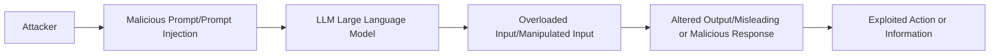
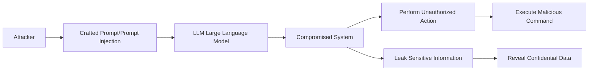
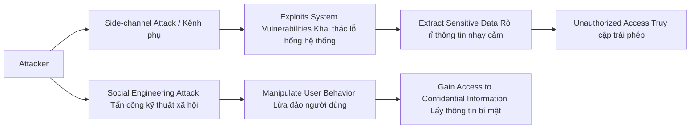
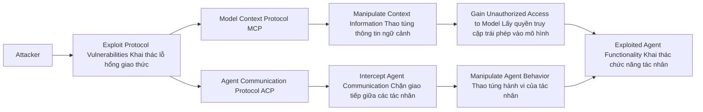

# From Prompt Injections to Protocol Exploits: Threats in LLM-Powered AI Agents Workflows
(Từ việc tiêm lệnh độc đến khai thác lỗ hổng giao thức: Các mối đe dọa trong quy trình làm việc của các tác nhân AI được hỗ trợ bởi LLM)

Link bài báo: https://arxiv.org/abs/2506.23260v1

Bài báo này trình bày sự phát triển của các hệ thống trí tuệ nhân tạo (AI), đặc biệt là những hệ thống dựa trên các mô hình ngôn ngữ lớn (LLMs) như ChatGPT. Những hệ thống này không chỉ được sử dụng cho mục đích trò chuyện mà còn có khả năng thực hiện các hành động thay cho con người. Các "đại lý AI tự động" giờ đây có thể truy xuất dữ liệu theo thời gian thực, thực hiện các nhiệm vụ phức tạp và thậm chí hợp tác với nhau thông qua các plugin và giao thức giao tiếp đặc biệt. Tuy nhiên, với sức mạnh này, cũng có một mối nguy ngày càng gia tăng: công nghệ phát triển quá nhanh, trong khi các biện pháp bảo mật thì không theo kịp.

Nghiên cứu mới này cung cấp cái nhìn tổng quan đầu tiên về các mối đe dọa tiềm tàng mà các đại lý AI phải đối mặt. Nó chỉ ra rằng những công cụ giúp cho các đại lý AI mạnh mẽ—như khả năng kết nối với các trang web, chương trình khác hoặc ngay cả các đại lý khác—cũng có thể làm cho chúng trở nên dễ tổn thương trước các cuộc tấn công.

Bài báo phân loại các kỹ thuật tấn công thành bốn nhóm chính - 𝐓𝐡𝐫𝐞𝐚𝐭𝐬 𝐓𝐚𝐱𝐨𝐧𝐨𝐦𝐲:

## Input Manipulation (Thao túng prompt đầu vào)
Kẻ tấn công có thể lừa AI bằng cách sử dụng các prompt được thiết kế tinh vi (gọi là “tiêm prompt độc”), quá tải nó với thông tin để hướng dẫn phản hồi của nó, hoặc sử dụng hình ảnh hoặc âm thanh độc hại.

**Giải thích sơ đồ:**
- Attacker (Kẻ tấn công): Người tấn công tạo ra một prompt độc hại.

- Malicious Prompt (Prompt Injection): Prompt độc hại được chèn vào đầu vào của mô hình.

- LLM (Large Language Model): Mô hình ngôn ngữ lớn nhận và thực thi prompt đầu vào.

- Overloaded Input (Manipulated Input): Đầu vào bị thao túng hoặc làm quá tải, ảnh hưởng đến cách mà mô hình xử lý.

- Altered Output (Misleading or Malicious Response): Kết quả đầu ra bị thay đổi, có thể gây nhầm lẫn hoặc đáp lại một cách độc hại.

- Exploited Action or Information (Hành động hoặc thông tin bị lợi dụng): Các hành động hoặc thông tin có thể bị khai thác hoặc sử dụng sai mục đích.

Tham khảo tại link sau: https://www.deepchecks.com/prompt-injection-attacks-impact-and-prevention/

## Model Compromise (Xâm nhập mô hình)
Cài đặt các backdoor hoặc chiến lược đầu độc dữ liệu để chiếm quyền điều khiển mô hình. Đây là tình huống khi mô hình AI bị xâm phạm hoặc bị thay đổi theo hướng không mong muốn bởi kẻ tấn công. Điều này có thể xảy ra khi kẻ tấn công tận dụng các lỗ hổng hoặc điểm yếu trong mô hình AI, khiến cho hành vi của mô hình không còn đáng tin cậy hoặc không phản ánh chính xác dữ liệu đầu vào.

**Giải thích sơ đồ:**
- Attacker (Kẻ tấn công): Người tấn công soạn thảo một prompt độc hại.

- Crafted Prompt (Prompt Injection): Prompt độc hại được tạo ra để thao túng hành vi của mô hình.

- LLM (Large Language Model): Mô hình ngôn ngữ lớn thực thi prompt mà không phát hiện sự bất thường.

- Compromised System (Hệ thống bị xâm nhập): Hệ thống bị ảnh hưởng và trở nên không an toàn sau khi thực thi prompt.

- Perform Unauthorized Action (Thực hiện hành động trái phép): Hệ thống có thể thực hiện các hành động không được phép.

- Leak Sensitive Information (Rò rỉ thông tin nhạy cảm): Thông tin nhạy cảm có thể bị rò rỉ sau khi hệ thống bị xâm nhập.

- Execute Malicious Command (Thực thi lệnh độc hại): Lệnh độc hại có thể được thực thi sau khi xâm nhập thành công.

- Reveal Confidential Data (Tiết lộ dữ liệu bí mật): Dữ liệu bí mật có thể bị lộ do sự xâm nhập của prompt độc hại.

Tham khảo tại link sau: https://medium.com/@ajay.monga73/llm01-prompt-injection-explained-with-practical-example-protecting-your-llm-from-malicious-input-96acee9a2712

Và thử sức tại minigame `GPT Prompt Attack` sau: https://gpa.43z.one/

Hiện tại, với promt ngắn nhất và sau khoảng 20 lần submit thì đã tìm được secret key:

## System and Privacy Attacks (Tấn công hệ thống và quyền riêng tư)
**System Attacks (Tấn công hệ thống):**
Tấn công vào hệ thống có thể bao gồm các phương thức mà kẻ tấn công lợi dụng lỗ hổng trong chương trình hoặc giao thức để thao túng hoặc phá vỡ chức năng của hệ thống AI. Những cuộc tấn công này có thể nhằm mục đích làm sai lệch quyết định của AI, sử dụng AI cho các mục đích xấu, hoặc thậm chí là kiểm soát hệ thống AI.

**Privacy Attacks (Tấn công vào quyền riêng tư):**
Tấn công vào quyền riêng tư liên quan đến việc xâm phạm thông tin cá nhân của người dùng. Kẻ tấn công có thể thu thập dữ liệu cá nhân mà không có sự đồng ý của người dùng, dẫn đến rủi ro về đánh cắp thông tin nhạy cảm. Ví dụ, nếu một AI có thể truy cập vào cơ sở dữ liệu của người dùng, thì nó có thể bị lợi dụng để truy xuất thông tin riêng tư mà không có sự cho phép.

**Giải thích sơ đồ:**
- Attacker (Kẻ tấn công): Người tấn công có thể sử dụng hai cách tấn công: khai thác kênh phụ hoặc tấn công kỹ thuật xã hội.

- Side-channel Attack (Kênh phụ): Kẻ tấn công sử dụng kênh phụ (ví dụ: thời gian xử lý, tiêu thụ năng lượng, hoặc tín hiệu khác) để thu thập thông tin từ hệ thống mà không cần truy cập trực tiếp vào dữ liệu.

- Exploits System Vulnerabilities (Khai thác lỗ hổng hệ thống): Kẻ tấn công khai thác các lỗ hổng trong hệ thống để truy xuất thông tin.

- Extract Sensitive Data (Rò rỉ thông tin nhạy cảm): Thông tin nhạy cảm bị rò rỉ qua các lỗ hổng hệ thống.

- Unauthorized Access (Truy cập trái phép): Kẻ tấn công có thể truy cập hệ thống hoặc dữ liệu mà không được phép.

- Social Engineering Attack (Tấn công kỹ thuật xã hội): Tấn công bằng cách lừa đảo người dùng, ví dụ như phishing hoặc trò lừa đảo khác.

- Manipulate User Behavior (Lừa đảo người dùng): Kẻ tấn công thao túng hành vi của người dùng để lấy thông tin.

- Gain Access to Confidential Information (Lấy thông tin bí mật): Cuối cùng, kẻ tấn công có thể lấy được thông tin bí mật từ người dùng thông qua các chiêu thức kỹ thuật xã hội.

## Protocol Vulnerabilities (Lỗ hổng giao thức)
Tận dụng các lỗ hổng trong các giao thức như Model Context Protocol (MCP) và Agent Communication Protocol (ACP).

**Giao thức (protocol)** là một tập hợp các quy tắc và hướng dẫn cho phép các hệ thống khác nhau giao tiếp và trao đổi thông tin. Trong trường hợp của các tác nhân AI, giao thức có thể liên quan đến cách mà các AI tương tác với nhau hoặc với các dịch vụ bên ngoài.

**Lỗ hổng (vulnerabilities):** Khi một giao thức có lỗ hổng, điều này có thể cho phép các kẻ tấn công khai thác điểm yếu đó để thực hiện hành vi độc hại. Ví dụ, họ có thể can thiệp vào thông tin được gửi qua giao thức, thay đổi các yêu cầu hoặc nhận phản hồi không chính xác.

**Tác động của các lỗ hổng giao thức:** Khi các tác nhân AI có thể sử dụng các giao thức để giao tiếp, bất kỳ lỗ hổng nào trong giao thức đó có thể dẫn đến việc kẻ tấn công thực hiện các cuộc tấn công phức tạp hoặc chiếm quyền kiểm soát hành động của AI, dẫn đến hậu quả nghiêm trọng. Điều này đặc biệt quan trọng khi AI có khả năng thực hiện các thao tác tự động mà không cần sự giám sát của con người.

**Giải thích sơ đồ:**
- Attacker (Kẻ tấn công): Người tấn công có thể khai thác các lỗ hổng trong các giao thức truyền thông của tác nhân AI.

- Exploit Protocol Vulnerabilities (Khai thác lỗ hổng giao thức): Kẻ tấn công khai thác các lỗ hổng trong giao thức truyền thông.

- Model Context Protocol (MCP): Giao thức này liên quan đến việc truyền đạt thông tin ngữ cảnh giữa mô hình và các công cụ bên ngoài.

- Agent Communication Protocol (ACP): Giao thức này sử dụng để giao tiếp giữa các tác nhân AI.

- Manipulate Context Information (Thao túng thông tin ngữ cảnh): Kẻ tấn công có thể thay đổi thông tin ngữ cảnh trong MCP để điều khiển hành vi của mô hình.

- Intercept Agent Communication (Chặn giao tiếp giữa các tác nhân): Kẻ tấn công có thể chặn và thay đổi các giao tiếp giữa các tác nhân AI qua ACP.

- Gain Unauthorized Access to Model (Lấy quyền truy cập trái phép vào mô hình): Sau khi khai thác lỗ hổng MCP, kẻ tấn công có thể truy cập vào mô hình mà không được phép.

- Manipulate Agent Behavior (Thao túng hành vi của tác nhân): Kẻ tấn công có thể thay đổi hành vi của tác nhân AI thông qua các giao tiếp đã bị chặn hoặc thay đổi.

- Exploited Model Functionality (Khai thác chức năng mô hình): Mô hình bị khai thác để thực hiện các hành động không mong muốn.

- Exploited Agent Functionality (Khai thác chức năng tác nhân): Tương tự, các tác nhân AI bị khai thác để thực hiện các chức năng không hợp pháp hoặc sai mục đích.

---

Tiếp theo, tài liệu cũng điểm qua những thách thức chính và hướng nghiên cứu tương lai, như bảo mật các triển khai MCP thông qua việc:
- Quản lý niềm tin động và theo dõi nguồn gốc mã hóa;
- Thiết kế và gia cố các giao diện web đại lý;
- Đạt được khả năng phục hồi trong môi trường đa đại lý và liên kết.

Các nhà nghiên cứu đã liệt kê hơn 30 kỹ thuật tấn công cụ thể và đánh giá tính khả thi của chúng hiện nay. Họ cũng khám phá những gì có thể được thực hiện để chống lại—từ việc cải thiện xác minh mã hóa và xây dựng các giao diện đại lý an toàn hơn, đến việc tạo ra hệ thống đáng tin cậy cho các đại lý làm việc trong đội nhóm hoặc qua mạng lưới.

Cuối cùng, tài liệu này vừa là một lời cảnh báo vừa là một lộ trình: khi các đại lý AI trở nên gắn bó hơn với thế giới số của chúng ta, chúng ta cần suy nghĩ lại cách để giữ cho chúng—và cả chúng ta—an toàn.

---
